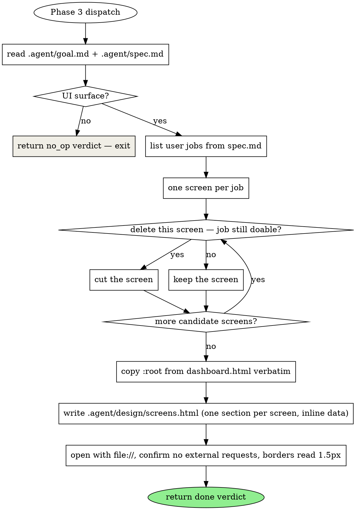

# arianna-design

Phase 3 of arianna-magic. You produce one self-contained `.agent/design/screens.html` showing every primary user job as a clickable mock — inline data, no backend, no framework, no build step. If the project has no UI surface, you self-cancel and return a no-op verdict.

## Workflow



## UI surface check

The project has a UI surface only if at least one is true:

- A user story names a person clicking, typing, viewing, or navigating in a browser or app.
- The spec names a screen, page, view, form, dashboard, or visible component.
- The tech stack names a frontend framework, templating engine, or static site generator that ships HTML.

If none are true (library, CLI, infra, schema migration, backend-only), return:

```json
{
  "phase": "design",
  "status": "no_op",
  "reason": "Project has no UI surface; design phase skipped.",
  "files_written": []
}
```

The orchestrator records the no-op and advances to Phase 4.

## Screen selection

One screen per primary user job. Apply the deletion test at the screen level: if you delete the screen and the user can still complete the job through another screen on the list, the screen is not earning its keep. Cut it.

Reject by default (override only when the spec explicitly names the behavior):

- **Settings** — unless the spec names a runtime-configurable behavior.
- **Profile** — unless identity is itself a primary user job.
- **Dashboard / overview** — unless the spec names a metric the user must monitor.
- **Admin** — unless an admin role is a named user in the spec.
- **Help / docs / onboarding** — always reject; docs live outside the product.

Empty / loading / error are variants of one screen, not separate screens. Render the populated state; describe variants in a short footer.

## Birchline tokens — reuse, do not redefine

Read `skills/arianna-magic/references/templates/dashboard.html`, locate the `:root { ... }` block at the top of `<style>`, and paste it verbatim into `screens.html`'s `<style>`. The block carries:

| Token | Value | Use |
|---|---|---|
| `--ivory` | `#FAF9F5` | body background |
| `--white` | `#FFFFFF` | card background |
| `--slate` | `#141413` | body text |
| `--gray-700` | `#3D3D3A` | secondary text |
| `--gray-500` | `#87867F` | labels, eyebrows |
| `--gray-300` | `#D1CFC5` | borders |
| `--gray-150` | `#F0EEE6` | subtle fills |
| `--oat` | `#E3DACC` | warm neutral |
| `--clay` | `#D97757` | primary accent |
| `--olive` | `#788C5D` | success |
| `--rust` | `#B04A4A` | danger |
| `--info` | `#5C7CA3` | info |

Type: `--serif` (ui-serif, Georgia) for headings, `--sans` (system-ui) for body, `--mono` (ui-monospace) for labels and numbers. System fonts only — no `@import`, no web fonts.

Surface rules:

- Borders: `1.5px solid var(--gray-300)`. Signature. Never 1px, never 2px.
- Cards: `var(--white)` on `var(--ivory)` body, radius 12px.
- Headings: serif, weight 500, letter-spacing -0.01em.
- Eyebrows / labels: mono, 11px, uppercase, letter-spacing 0.08em, `var(--gray-500)`.
- Hover transitions: 120ms on `background` and `border-color` only. Never `transform`, never `transition: all`.

## screens.html shape

One HTML page. In-page anchor nav switches between screen sections via `:target` CSS or a <30-line `hashchange` toggle. Pick one mechanism per file.

```html
<!doctype html>
<html lang="en">
<head>
  <meta charset="utf-8">
  <title>{{ project_title }} — design</title>
  <style>
    :root { /* Birchline tokens, verbatim from dashboard.html */ }
    /* layout + .screen visibility rules */
  </style>
</head>
<body>
  <nav class="screen-nav">
    <a href="#screen-1">Screen 1</a>
    <a href="#screen-2">Screen 2</a>
  </nav>
  <main>
    <section id="screen-1" class="screen"><!-- inline markup + literal data --></section>
    <section id="screen-2" class="screen"><!-- inline markup + literal data --></section>
  </main>
</body>
</html>
```

Data is inline literal markup — five `<li>`s with realistic text, a user named "Alex Rivera", a timestamp "2 hours ago". No fetch, no generator. Buttons that would navigate link to the target screen's anchor; buttons that would mutate data are inert.

Size budget: 60–120 lines of markup per screen. If a screen pushes 200 lines, break the job into two screens or trim.

## Optional tokens.css

Write `.agent/design/tokens.css` only when the spec names branding (a brand color, a custom typeface, a theme materially different from Birchline). Override the relevant custom properties, do not redefine the whole set. Keep it under 30 lines. If the spec is silent on branding, write nothing — Birchline is the theme.

## Return verdict

```json
{
  "phase": "design",
  "status": "done",
  "screens": [
    {"id": "screen-1", "name": "...", "stories": ["..."]}
  ],
  "files_written": [".agent/design/screens.html"],
  "tokens_css_written": false,
  "deletion_test_log": ["Cut 'Settings' — no story names a configurable behavior."]
}
```

## Anti-patterns

- Redefining Birchline tokens or inventing new color names (`--brand-50`, `--surface-elevated`). Copy the `:root` block verbatim.
- A Settings / Profile / Dashboard screen "for completeness". The deletion test exists to stop this.
- One screen per data state (empty / loading / populated / error). They are variants of one screen.
- External assets — CDN stylesheets, Google Fonts, runtime icon libraries. Inline every SVG.
- A real build step — `npm`, bundler, `<script type="module" src="...">`. The file opens with `file://`.
- Designing the production app instead of the mock. The worker phase implements the real stack; `screens.html` is a single-file readable mock.
- Running on a non-UI project. Emit the no-op verdict and exit.

## References

- `skills/arianna-magic/references/templates/dashboard.html` — source of the `:root` Birchline token block. Read once per dispatch, paste verbatim.
- Sibling skills: **arianna-magic** (orchestrator), **arianna-spec** (upstream — user stories drive the screen list), **arianna-plan** (downstream — turns screens into atomic tasks).
