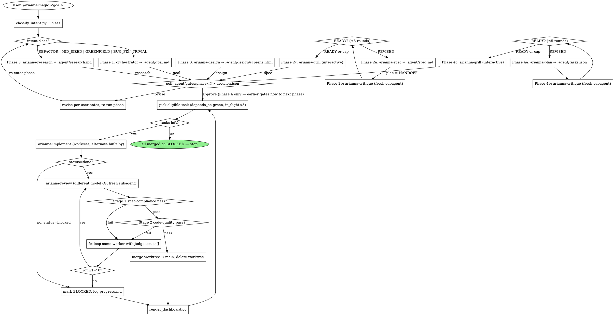

# arianna-magic

You classify intent, walk the workflow below, dispatch role subagents, persist state in `.agent/`, and render the dashboard. Eight sibling role skills do the work — you do not write specs, code, designs, or reviews.

## Workflow



The diamond labelled "intent class?" carries the routing: `TRIVIAL` skips to Phase 1 (then 5+6); `REFACTOR`, `MID_SIZED`, `BUG_FIX` enter at Phase 0 and skip Phase 3 unless the goal has a UI surface; `GREENFIELD` walks every phase.

Phase 1 (Discover) is one or two clarifying questions you ask the user yourself, then write `.agent/goal.md`. Every other phase dispatches a role subagent.

## Dispatch contract

Every role subagent gets the same shape. Render it with `scripts/wrap_phase_prompt.py <phase> --state <files...>` and spawn (Claude Code `Agent` with `isolation: "worktree"`; Codex equivalent).

```
Read skills/arianna-<role>/SKILL.md and follow it.

## State files attached
[absolute paths the role reads — see table below]

## Constraints
- Stay in your worktree. Do not modify files outside your role's output scope.
- Worker only: HARD STOP, one task per invocation.
- Judge only: you are a different agent from the builder; verify by reading code, not the report.
- Critic only: stateless per round; do not load prior critique rounds.

## Return
A single JSON object as the last block of your reply. Schema in your role skill.
```

| Phase | Role skill | State files attached |
|---|---|---|
| 0 | `arianna-research` | the goal text |
| 2a | `arianna-spec` | `.agent/research.md`, `.agent/goal.md` |
| 2b / 4b | `arianna-critique` | `.agent/spec.md` (or `.agent/tasks.json`) — and nothing else |
| 2c / 4c | `arianna-grill` | `.agent/spec.md` (or `.agent/tasks.json`), repo-root `CONTEXT.md`, `docs/adr/` |
| 3 | `arianna-design` | `.agent/goal.md`, `.agent/spec.md` |
| 4a | `arianna-plan` | `.agent/spec.md` |
| 5 | `arianna-implement` | `.agent/implement.md`, `.agent/spec.md`, `.agent/tasks.json`, `task_id` |
| 6 | `arianna-review` | `.agent/review.md`, `.agent/spec.md`, `.agent/tasks.json`, `task_id`, `.agent/evidence/<task_id>/` |

Build/judge model rotation: `tasks.json` carries `built_by` per task. Alternate Claude / Codex per dispatch when both CLIs are available. The judge is always a different model or a fresh subagent of the same vendor — fresh context is the load-bearing property.

## Gates back-channel

After every pre-handoff phase: regenerate the dashboard, tell the user in chat to open `.agent/dashboard.html` and click Approve or Revise. The dashboard button triggers a browser download of `<phase>.decision.json`. The user moves it into `.agent/gates/`. You poll, read the verdict, delete the file, advance or revise. No synchronous user prompts during Phase 5+6.

## State files

| Path | Owner | Lifecycle | Tracked |
|---|---|---|---|
| `.agent/research.md` | arianna-research | source | committed |
| `.agent/goal.md` | orchestrator | source | committed |
| `.agent/spec.md` | arianna-spec + arianna-grill | source | committed |
| `.agent/tasks.json` | arianna-plan + arianna-grill | source | committed |
| `.agent/design/screens.html`, `.agent/design/tokens.css` | arianna-design | source | committed |
| `.agent/implement.md`, `.agent/review.md` | orchestrator (copy from `references/templates/`) | dispatch contract | committed |
| `.agent/evidence/<task-id>/` | arianna-implement + arianna-review | provenance | committed |
| `.agent/dashboard.html` | `scripts/render_dashboard.py` | regenerated per transition | committed |
| `.agent/progress.md` | orchestrator | working memory | gitignored |
| `.agent/gates/*.decision.json` | user → orchestrator | back-channel | gitignored |
| `.agent/*.lock`, `.agent/*.log` | runtime | runtime | gitignored |
| `CONTEXT.md` (repo root) | arianna-grill | shared language | committed with code |
| `docs/adr/NNNN-<slug>.md` (repo root) | arianna-grill | architectural decisions | committed with code |

Re-read `.agent/progress.md` before every decision; append to it after every dispatch, merge, or BLOCKED outcome.

## Dashboard

`scripts/render_dashboard.py --agent-dir .agent --out .agent/dashboard.html`. Self-contained Birchline-styled HTML (tokens in `references/templates/dashboard.html`: `--ivory: #FAF9F5`, `--clay: #D97757`, `--olive: #788C5D`, `--rust: #B04A4A`; 1.5px borders; 120ms hover on `background` and `border-color` only; system fonts only; no CDN, no external JS, no web fonts). Regenerate on every phase transition, every task merge, every BLOCKED.

## Scripts (Python 3 stdlib only)

| Script | Purpose |
|---|---|
| `scripts/classify_intent.py` | Map goal text → `{TRIVIAL, REFACTOR, MID_SIZED, GREENFIELD, BUG_FIX}` with confidence |
| `scripts/wrap_phase_prompt.py` | Render the dispatch contract for a given phase |
| `scripts/render_dashboard.py` | Read `.agent/` state, interpolate `references/templates/dashboard.html`, write `.agent/dashboard.html` |

No external Python deps. No `pip install`. No npm.

## Anti-patterns

- **Paraphrasing a role's methodology into the dispatch prompt.** Point at the role skill; do not summarise it. Summaries drift.
- **Merging a worker's worktree without a green judge.** Stage 1 and Stage 2 must both pass (or Stage 1 passes with only minor/nit issues from Stage 2).
- **Same model as builder and judge in the same context.** Spawn a different model, or at minimum a fresh subagent — fresh context is the load-bearing property.
- **More than 5 worker subagents in flight.** Merge conflicts dominate beyond that.
- **Forgetting to regenerate `.agent/dashboard.html`.** A stale dashboard mis-leads the user about which gate is open.
- **Synchronous user prompts during Phase 5+6.** The gates back-channel is the only user surface; the autonomous loop runs without you in the room.
- **Writing `spec.md`, `tasks.json`, or evidence yourself.** Role skills write them. The orchestrator records that they were written.

## References

- `references/templates/implement.md` — copy to `.agent/implement.md` at run init; defines the worker contract.
- `references/templates/review.md` — copy to `.agent/review.md` at run init; defines the judge contract including verbatim anti-cheat lines and the QA-module dispatch table.
- `references/templates/dashboard.html` — Birchline-styled dashboard skeleton consumed by `render_dashboard.py`.

Sibling role skills: `arianna-research`, `arianna-spec`, `arianna-design`, `arianna-plan`, `arianna-implement`, `arianna-review`, `arianna-critique`, `arianna-grill`.
