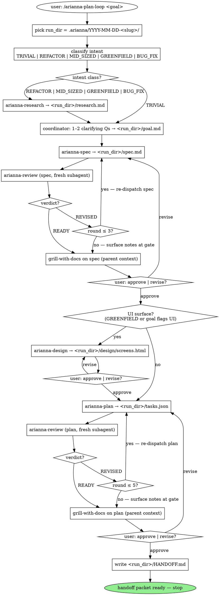

# arianna-plan-loop

You classify intent, walk the workflow below, dispatch role subagents, persist state in a per-run directory `<run_dir>`, and end at a single handoff packet. Six sibling role skills do the actual writing — you do not write specs, designs, plans, reviews, or grill questions yourself.

The bar is: would a fresh engineer (or a downstream build agent) be able to pick up `<run_dir>/HANDOFF.md` and start building without coming back to you for clarification? If yes, hand off. If no, you skipped a phase.

## Run directory

Before any dispatch, pick `<run_dir>` = `.arianna/YYYY-MM-DD-<slug>/`. Date from `date -I`, kebab-case slug from the goal text. If that directory already exists, append `-2`, `-3`, … until free. `mkdir -p <run_dir>` and tell the user the path.

To resume a prior run, the user names the existing dir in the goal text (e.g. "continue `.arianna/2026-05-04-session-revoke/`"). Don't auto-detect — the user knows when they're resuming.

`<run_dir>` is the absolute path you just made. Every dispatch below carries it verbatim; the role skills never invent it.

## Workflow



The "intent class?" diamond routes everything downstream:

| Class | Skips | Why |
|---|---|---|
| `TRIVIAL` | research, design | One file, one test, no architecture decision. Walk goal → spec → plan → handoff. |
| `REFACTOR` | design (unless UI churn) | Code shape change with no new behavior. |
| `BUG_FIX` | design | Root-cause + repro + fix. No new UI. |
| `MID_SIZED` | design (unless goal flags UI) | New behavior, no greenfield surface. |
| `GREENFIELD` | nothing | New product or feature surface — every phase fires. |

Pick the class yourself from the goal text. Heuristic: count concrete acceptance bullets — 1 bullet → TRIVIAL; bullets all start with "rename / extract / inline / move" → REFACTOR; bullets all describe a regression → BUG_FIX; bullets describe net-new behavior on an existing surface → MID_SIZED; bullets describe a new surface end-to-end → GREENFIELD. When in genuine doubt, ask the user once before walking the graph.

The goal phase (Step 2 below) is one or two clarifying questions you ask the user yourself, then write `<run_dir>/goal.md`. Every other phase dispatches a role subagent.

**User answers are a contract, not a hint.** Every clarifying question you ask the user (via AskUserQuestion or inline) must be recorded in `<run_dir>/goal.md` under a heading `## User decisions (preserved verbatim)`. The format is one bulleted entry per question:

```markdown
## User decisions (preserved verbatim)
- **Q:** <exact question text> **A:** <the option the user selected, verbatim — not paraphrased>
```

Downstream phases (arianna-spec, arianna-review, arianna-plan) cross-check their output against this section. A user answer recorded here as "Pluggable backend (Claude + Codex)" means BOTH ship — a Deferral, placeholder, or `NotImplementedError` that pushes one of them out is a coverage failure. The verbatim record exists because paraphrasing — "support Claude and Codex" instead of "ship both" — loses the bit that determines whether the spec can quietly drop one of them.

**No "v1", no "later", no "future option", no placeholders.** The spec, the plan, and the build describe what gets shipped — period. There is no "we'll add Codex in v2." If a user-named capability cannot be shipped, escalate to the user *before* the spec is written, not after. Catching it in grill or at the gate means everything downstream has to be redone.

## Dispatch contract

Every role subagent receives the same shape. Send it verbatim — paraphrasing a role's methodology in the dispatch prompt is the failure mode that drifts.

```
Read skills/<role>/SKILL.md and follow it.

## Run directory
<absolute path, e.g. /repo/.arianna/2026-05-11-session-revoke>

Inputs and outputs live inside this directory.

## State files attached
[the inputs the role reads — see table below]

## Constraints
- Stay in scope. Do not write outside your role's output files.
- Reviewer only: you are a fresh subagent; do not load prior review rounds.

## Return
A single JSON block as the last block of your reply. Schema in your role skill.
```

In Claude Code, spawn with the `Agent` tool. In Codex, use the equivalent subagent spawn. Use `isolation: "worktree"` only on the producer subagents (research, spec, design, plan) — review operates on `<run_dir>` artifacts and needs no worktree. The grill skill runs in the parent context (interactive with the user) — do not dispatch it as a subagent.

| Phase | Role skill | State files attached (all under `<run_dir>`) |
|---|---|---|
| Research | `arianna-research` | the goal text + intent class |
| Goal | _coordinator_ | n/a — you write `<run_dir>/goal.md` from the user's answers |
| Spec | `arianna-spec` | `research.md`, `goal.md` |
| Spec review | `arianna-review` | `spec.md` — and nothing else |
| Spec grill | `grill-with-docs` | _runs in parent context; see Grill loop below_ |
| Design | `arianna-design` | `goal.md`, `spec.md` |
| Plan | `arianna-plan` | `spec.md`, `research.md` (Quality Commands section) |
| Plan review | `arianna-review` | `tasks.json` — and nothing else |
| Plan grill | `grill-with-docs` | _runs in parent context; see Grill loop below_ |

## Review loop

After every producer writes its artifact, you dispatch `arianna-review` as a fresh subagent. Fresh per round is the load-bearing property — a reviewer who already argued the prior round defends the prior verdict; that is theatre, not review.

You own the round counter. The reviewer reports the current round in its JSON; you increment.

| Phase | Cap |
|---|---|
| Spec | 3 rounds |
| Plan | 5 rounds |

Round flow per artifact:

1. Producer writes the artifact.
2. Dispatch `arianna-review` fresh. It returns `verdict: "READY"` or `"REVISED"` with `specific_issues[]`.
3. If `READY` → grill.
4. If `REVISED` and round < cap → re-dispatch the producer with the issues attached; back to step 2 with round + 1.
5. If `REVISED` and round = cap → grill with the residual issues surfaced; let the user decide at the gate.

Never pass a prior reviewer's JSON into the next reviewer round — the reviewer's `references/contamination.md` calls that out as a broken dispatch.

## Grill loop

After review converges (or hits cap), load `skills/grill-with-docs/SKILL.md` and run the grill **in the parent context** — it is interactive with the user, one question at a time. Do not dispatch grill as a subagent.

Before opening the interview, surface the docs the grill challenges against: the artifact under review (`<run_dir>/spec.md` or `<run_dir>/tasks.json`), plus `<run_dir>/CONTEXT.md` and repo-root `docs/adr/` if they exist, plus `<run_dir>/research.md`. These are the "docs" in grill-with-docs — Pocock's skill assumes a repo's long-lived domain docs exist; in this loop they live under `<run_dir>` and repo-root `docs/adr/` and are maintained by you (see below).

The grill stops itself when the user signals done or no high-leverage question remains. There is no JSON return — the grill ends when the conversation ends. You count the user turns and the substantive answers, and use them in your post-grill bookkeeping.

### Post-grill bookkeeping

The grill skill is consultative — it asks, the user answers. You persist the answers. After the grill conversation ends, read your own transcript of the exchange and apply these write-backs:

| If the grill exchange produced | Then you write |
|---|---|
| A resolved Concept (term canonised, ambiguity settled) | Append the term to `<run_dir>/CONTEXT.md` (create if absent). One H2 per term, definition next line, optional `_Avoid_:` line. |
| A crystallised Decision (rejected alternative + trade-off named) | Update the relevant Decision paragraph in `<run_dir>/spec.md` Decisions. If the user named the rejected alternative for an `<!-- adr-candidate -->` marked Decision and it passes the three-bar test (hard to reverse, surprising, real trade-off), create repo-root `docs/adr/NNNN-<slug>.md` with one paragraph naming chosen + rejected + trade-off. |
| An unblocked Deferral (the unblocker fact named) | Replace the `Deferred:` paragraph in `<run_dir>/spec.md` with a Decision paragraph. |
| A dropped narrative-order `depends_on` edge in `tasks.json` | Edit the task's `depends_on` array; note in the task's rationale that the user confirmed parallelisability. |
| Vocabulary in the artifact that drifts from CONTEXT.md | Update the artifact to use the CONTEXT.md term. |

Do not polish nearby prose during write-back. Every untouched line is one fewer line to defend at the gate. After every edit to `<run_dir>/tasks.json`, round-trip through `python -m json.tool` to confirm valid JSON.

You do not own the grill's question budget; the user does. Treat "done", "good enough", "ship it", or three turns of confirmation-only exchanges as your stop signal. Move to the gate.

## Gates (synchronous, inline)

After grill returns, ask the user inline: "Approve `<artifact>` and continue to `<next phase>`, or revise?" No dashboard, no file polling, no async back-channel — this is a planning coordinator, you are in the room for every gate.

| Gate | Approval routes to | Revise routes to |
|---|---|---|
| After spec grill | design (if UI surface) or plan | re-dispatch `arianna-spec` with user notes |
| After design | plan | re-dispatch `arianna-design` with user notes |
| After plan grill | handoff | re-dispatch `arianna-plan` with user notes |

A revise routes back to the producer, not back to review — the producer's next draft enters review fresh. If the user revises three times in a row at the same gate without converging, stop and surface the impasse; do not loop silently.

## Handoff

When the plan gate is approved, write `<run_dir>/HANDOFF.md`. It is a one-page index, not a re-statement of the artifacts. Pointers + the bare facts a build agent needs to pick up. All artifact paths in the handoff are written as full paths under `<run_dir>` so a downstream agent can open them directly.

```markdown
# Handoff — <goal slug>

**Run directory:** `<run_dir>` (everything below lives inside it)
**Intent class:** <TRIVIAL | REFACTOR | MID_SIZED | GREENFIELD | BUG_FIX>
**Reviewed:** spec (N rounds, READY), plan (M rounds, READY)
**Grilled:** spec (Q questions), plan (Q questions)

## Artifacts
- Goal: `<run_dir>/goal.md`
- Research: `<run_dir>/research.md`
- Spec: `<run_dir>/spec.md`
- Design (if any): `<run_dir>/design/screens.html`
- Plan: `<run_dir>/tasks.json` — N tasks, max wave width W
- Glossary: `<run_dir>/CONTEXT.md` (if created)
- ADRs: repo-root `docs/adr/*.md` (if created — shared across runs)

## Quality commands
<verbatim copy from research.md § Quality Commands>

## Open concerns
<any concerns[] returned by review or grill in their last round>

## Build entry point
First task by topological order: `<task-id>` — `<one-line acceptance>`
```

Then stop. Do not dispatch an implementer. Do not offer to "start on the first task" — the user picks the build coordinator (or builds by hand) from here.

## State files

All paths below are relative to `<run_dir>` (e.g. `.arianna/2026-05-11-session-revoke/`). The only state outside `<run_dir>` is repo-root `docs/adr/*.md`, which is shared across runs by design.

| Path | Owner | Lifecycle |
|---|---|---|
| `<run_dir>/goal.md` | coordinator | source, committed |
| `<run_dir>/research.md` | arianna-research | source, committed |
| `<run_dir>/spec.md` | arianna-spec + coordinator (post-grill write-back) | source, committed |
| `<run_dir>/design/screens.html`, `<run_dir>/design/tokens.css` | arianna-design | source, committed |
| `<run_dir>/tasks.json` | arianna-plan + coordinator (post-grill write-back) | source, committed |
| `<run_dir>/HANDOFF.md` | coordinator | source, committed |
| `<run_dir>/CONTEXT.md` | coordinator (post-grill, lazy) | source, committed |
| `<run_dir>/progress.md` | coordinator | working memory, gitignored |
| `docs/adr/NNNN-<slug>.md` (repo root) | coordinator (post-grill, three-bar test, lazy) | source, committed |

Re-read `<run_dir>/progress.md` before every dispatch. Append to it after every producer return, every review verdict, every grill session, every gate decision. The file is your working memory across rounds — your context window drifts, the file does not.

## Anti-patterns

- **Paraphrasing a role's methodology into the dispatch prompt.** Point at the role skill; do not summarise it. Summaries drift across runs.
- **Writing `spec.md`, `tasks.json`, or the HANDOFF body yourself.** Role skills write them; you record that they were written.
- **Passing a prior reviewer's JSON into the next round.** Fresh per round is the load-bearing property. Doing this defeats the entire review.
- **Skipping the grill when review returns READY at round 1.** READY says the artifact is internally coherent; grill catches what the writer and the critic could not see — assumptions the user is making silently.
- **Looping forever on a stuck gate.** Three revises at the same gate without convergence is a different problem than draft quality. Stop, name the impasse.
- **Offering to build after handoff.** This skill ends at `HANDOFF.md`. The next move belongs to the user or a build coordinator, not you.
- **Forgetting to log round counts in `HANDOFF.md`.** The reader needs to know whether spec went READY at round 1 or limped past the cap — those imply very different artifact confidence.
- **Writing to bare `.arianna/spec.md`.** Always under `<run_dir>`. Two parallel loops collide otherwise.

## References

Sibling role skills:

- `arianna-research` — Phase 0 parallel-topic research, writes `<run_dir>/research.md`.
- `arianna-spec` — writes `<run_dir>/spec.md` (Concepts, Stories, Decisions, Modules, Deferrals). Marks ADR candidates with `<!-- adr-candidate -->`.
- `arianna-design` — writes `<run_dir>/design/screens.html` + tokens.
- `arianna-plan` — writes `<run_dir>/tasks.json` (atomic, tagged, DAG-sound).
- `arianna-review` — fresh-subagent reviewer used on spec and plan. Returns READY or REVISED.
- `grill-with-docs` — interactive interview used after review converges. Loaded into the parent context, not dispatched as a subagent. You apply its outcomes to `<run_dir>/spec.md` / `<run_dir>/tasks.json` / `<run_dir>/CONTEXT.md` / repo-root `docs/adr/` per the post-grill bookkeeping table above.
