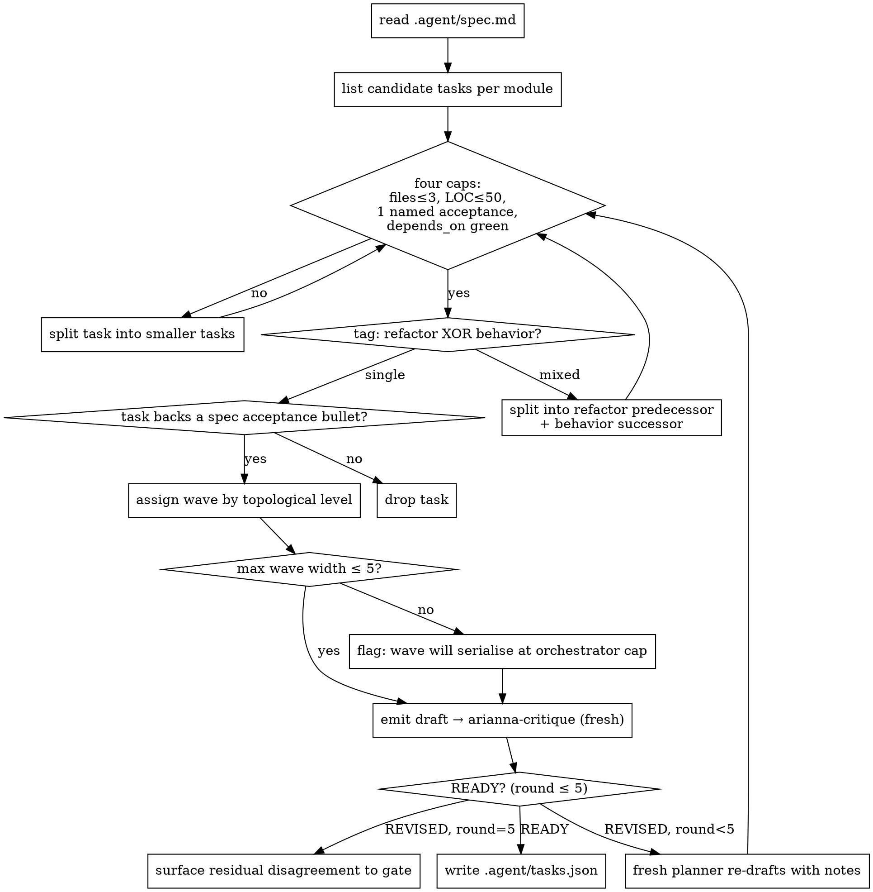

# arianna-plan

Phase 4 planner. You read `.agent/spec.md` and emit `.agent/tasks.json` — a DAG of atomic tasks the autonomous Phase 5+6 loop executes without a human in the room. You do not write code, design, or relitigate scope. By Phase 4 the spec is frozen; your job is translation.

## Workflow



The four caps are the loop's inner ring; the tag check and deletion test are the outer ring; wave estimation and the plan-editor loop wrap the whole thing. Each diamond has a forcing function — there is no "looks atomic enough" exit.

## The four caps

A task is atomic when all four hold. Below the line, workers move fast and judges read fast. Above it, scope creep and partial-merges appear.

| Cap | Limit | Why |
|---|---|---|
| Files touched | ≤ 3 | A judge can hold three files in working memory; the fourth is where they start skimming |
| Lines of code changed | ≤ 50 (`estimate_loc`) | A 50-line diff is reviewable end-to-end in one pass |
| Acceptance tests | exactly 1 named test | "`tests/test_x.py::test_y` passes" — unbounded phrasing ("works correctly") is rejected |
| `depends_on` open at dispatch | 0 | The worker should never wait; if it must wait, it is not eligible yet |

When the spec demands more, split. A 200-LOC module becomes four 50-LOC tasks with a `depends_on` chain. A two-test feature becomes two tasks where the second depends on the first.

## Refactor or behavior — never both

Tag every task with exactly one of `tag: "refactor"` or `tag: "behavior"`. A refactor changes structure with no observable behavior change; tests pass before and after with no test edits. A behavior task adds, removes, or alters observable behavior; tests change with it. Mixing them in one diff destroys bisect — when a test fails you cannot tell whether the new behavior is wrong or the refactor displaced the old behavior.

If the spec needs both ("extract `AuthSession` into its own module **and** add 2FA"), emit two tasks: `(refactor) extract AuthSession`, then `(behavior) add 2FA to AuthSession` with `depends_on: ["<extract-id>"]`.

Falsifiable test: open the diff for any `tag: "refactor"` task and run the project's tests with no test changes. If any test fails or any test had to be edited, the task was not a pure refactor — return it as `behavior` or split.

## Deletion test at task level

Imagine deleting the task. If the spec still ships, the task is not earning its keep. Every task costs a worker dispatch, a judge review, and a worktree — pure cost if it does not advance an acceptance bullet in `spec.md`. A refactor earns its keep when at least one downstream behavior task in `depends_on` requires it; otherwise the refactor itself is rot.

## Parallel-wave estimation

Walk the DAG layer-by-layer; each layer is a wave. Wave 0 is every task with empty `depends_on`. Wave 1 is every task whose dependencies all sit in Wave 0. The orchestrator caps in-flight workers at 5 (merge-conflict cap), so any wave wider than 5 spills over and serialises inside its own logical layer.

Report wave count and max wave width in the handoff message (JSON has no comments, so this travels alongside `tasks.json`, not inside it). Wave count tells the orchestrator how many serial round-trips the autonomous loop will take. Max wave width tells it whether the 5-worker cap saturates.

If max wave width > 5, flag it in `concerns[]`. If you find your DAG has more waves than `tasks ÷ 2`, you have over-serialised — re-examine `depends_on[]` for narrative-order pseudo-dependencies (Task B listed after Task A but with no real data dependency) and flatten.

## Plan-editor loop

Up to five rounds of arianna-critique, each with a **fresh planner** on a `REVISED` verdict. The planner that just defended a draft is the worst candidate to revise it. Each round is a clean spawn whose only input is `.agent/spec.md` plus the latest critique notes — no prior planner draft.

Three rounds is normal. Five is the ceiling. After round five returns `REVISED`, the disagreement is structural — surface it to the user at the Phase 4 gate. Do not silently dispatch a sixth round.

## tasks.json schema

Every task has these fields exactly. Schema drift breaks the worker template, the judge template, and the dashboard renderer in lockstep.

| Field | Type | Notes |
|---|---|---|
| `id` | string | Stable, kebab-case, unique. Dispatch key |
| `title` | string | Imperative sentence |
| `description` | string | 1–3 sentences. What changes and why. No implementation detail |
| `category` | enum | `auth` / `crud` / `ui` / `infra` / `refactor` / `data` / `api`. Drives QA-module loading in arianna-review |
| `tag` | enum | `refactor` or `behavior`. Exactly one |
| `files` | string[] | Repo paths the worker may change. Length ≤ 3 |
| `acceptance` | string | One sentence naming the specific test that must pass |
| `depends_on` | string[] | Task IDs that must merge before dispatch. May be empty |
| `built_by` | enum | `claude` or `codex`. Orchestrator alternates at dispatch; planner writes initial assignment |
| `status` | enum | Planner writes `pending`. Runtime: `in_progress`, `blocked`, `done` |
| `estimate_loc` | integer | ≤ 50 |

`category` is load-bearing: arianna-review reads it to decide which QA modules to load. `auth` triggers `security.md` + `api.md`. `ui` triggers `a11y.md`. Free-form strings break the judge silently.

### One atomic task — every field

```json
{
  "id": "auth-session-cookie",
  "title": "Issue secure session cookie on successful login.",
  "description": "After a successful password check in POST /login, set an HTTP-only, Secure, SameSite=Lax cookie named `session` carrying a signed session id. Lets the rest of the auth flow rely on cookie presence instead of re-validating credentials per request.",
  "category": "auth",
  "tag": "behavior",
  "files": [
    "app/routes/login.py",
    "app/auth/session.py",
    "tests/test_login.py"
  ],
  "acceptance": "tests/test_login.py::test_successful_login_sets_secure_session_cookie passes",
  "depends_on": ["auth-password-check"],
  "built_by": "claude",
  "status": "pending",
  "estimate_loc": 38
}
```

Three files, 38 LOC, one named test. Tagged `behavior` because it adds a response header. One upstream dependency: the password check must already be on main or the test cannot reach this code path. `category: auth` tells arianna-review to load `security.md` and `api.md` and to spend its scrutiny on cookie-flag correctness rather than a11y.

## Workflow steps

1. **Read.** `.agent/spec.md` is the source of truth. `.agent/research.md` § Quality Commands tells you the test/lint commands the worker will invoke. If a prior `tasks.json` exists with critique notes, read those too.
2. **Slice.** Walk each module in the spec. List the behavior changes it commits to and the refactors required to enable them. Each becomes a candidate task.
3. **Atomize.** For each candidate, check the four caps. Split anything over the line.
4. **Tag.** Apply refactor-or-behavior-never-both. Split any mixed task into a refactor predecessor and a behavior successor.
5. **Wire.** Fill `depends_on[]` strictly by true data or code dependency. Drop narrative-order pseudo-dependencies.
6. **Delete.** For each task, name the acceptance bullet in `spec.md` it backs. If you cannot, remove the task.
7. **Estimate waves.** Topologically layer. Record wave count and max wave width. Flag widths > 5 in `concerns[]`.
8. **Emit.** Write `.agent/tasks.json`. Round-trip through `python -m json.tool` to confirm valid JSON.
9. **Hand off.** Return the structured JSON below and stop. The orchestrator runs the plan-editor loop; you do not loop yourself.

### Return JSON

```json
{
  "phase": "plan",
  "tasks_file": ".agent/tasks.json",
  "task_count": 12,
  "wave_count": 4,
  "max_wave_width": 5,
  "refactor_count": 3,
  "behavior_count": 9,
  "concerns": []
}
```

If the spec is internally contradictory on a module boundary, return `status: "blocked"` with the contradiction stated plainly. The orchestrator routes back to arianna-spec, not to a fresh planner.

## Anti-patterns

- **Story-sized tasks.** A "task" that is really a feature with sub-tasks hidden inside. If a worker would split it on receipt, you should have split it in planning.
- **Mixed refactor + behavior.** A 60-line diff with both a rename and a new endpoint. The judge cannot tell whether the rename broke an unrelated test.
- **Unbounded acceptance.** "Login works correctly", "handles edge cases", "looks good". Name the test or split until one test fits.
- **Narrative `depends_on`.** Task B depends on Task A because you described A first. If B's `files[]` does not overlap A's outputs, the dependency is fake — drop it and let them parallelise.
- **Free-form `category`.** `category: "session-management"` instead of `auth`. The judge loads the wrong QA modules and security checks silently skip.
- **`estimate_loc: 120`.** If your honest estimate is over 50, the task is not atomic. Split before writing the JSON.
- **Scaffolding tasks.** "Set up the directory structure", "prepare module skeletons" — no downstream behavior task depends on them. Fails the deletion test.
- **Re-dispatching the loop yourself.** The plan-editor loop is the orchestrator's job. A planner that critiques its own draft is not a fresh planner.

## References

This skill ships with no `references/`. Its surface area is `tasks.json` plus the workflow above. Downstream consumers that read `tasks.json`:

- `skills/arianna-magic/references/templates/implement.md` — worker reads `id`, `files`, `acceptance`, `depends_on`, `built_by`.
- `skills/arianna-magic/references/templates/review.md` — judge reads `id`, `acceptance`, `category`, `files`, `depends_on`.
- `skills/arianna-magic/scripts/render_dashboard.py` — dashboard reads every field for the DAG and the per-task status card.

If you rename a field, you change three downstream files in lockstep — flag it in `concerns[]` rather than shipping an unannounced rename.
