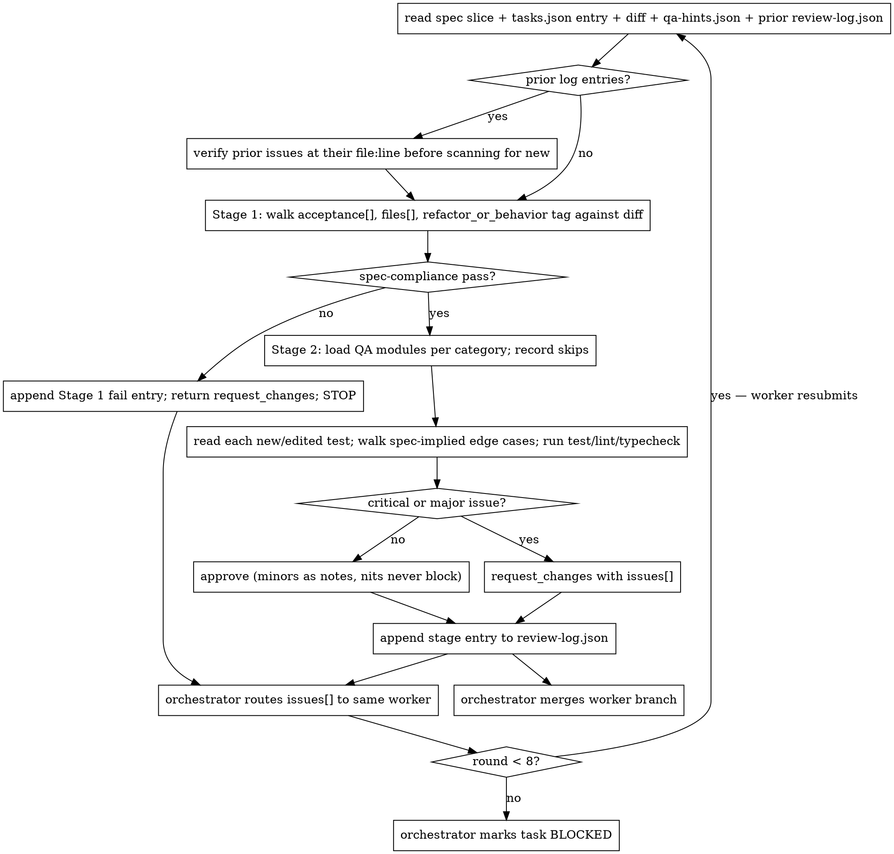

# arianna-review

A fresh judge reviews exactly one task in two stages, by reading the code — not the worker's report. Stage 1 is cheap: does the diff match the plan? Stage 2 runs only if Stage 1 passes and goes deeper than the worker did. The split forces the verdict to name the layer the fix-loop must return to.

## Workflow



The fix-loop cap is 8 rounds per task. After that the orchestrator marks BLOCKED and continues with non-dependent work.

## Inputs

Read in this order: `.agent/spec.md` (only sections named in the task's `spec_refs[]`), the single `tasks.json` entry for the dispatched `task_id` (`acceptance[]`, `files[]`, `category`, `refactor_or_behavior`, `depends_on`), the diff on the worker's branch end to end, `.agent/evidence/<task_id>/qa-hints.json` (worker's advice letter; `needs_deeper_qa[]` is where Stage 2 scrutiny starts), and `.agent/evidence/<task_id>/review-log.json` (prior rounds; may be empty on round 1).

## Stage 1: spec-compliance

One question: does the diff match the plan?

- For each item in `acceptance[]`: met / partially met / not met. Quote the code or test that meets it; if none, name what is missing.
- Compare the diff's file list against `files[]`. Untouched-but-listed and touched-but-unlisted are both Stage 1 fails unless the worker's report justifies the deviation and the spec agrees.
- Check `refactor_or_behavior`: a `refactor` task whose diff changes observable behavior fails; a `behavior` task whose diff only restructures fails.

If Stage 1 fails, append the entry, return `request_changes`, and stop. Do not run Stage 2 — the fix-loop returns to the spec or plan layer, not to the worker's code.

`verdict_reasoning` for Stage 1 must name at least one specific `acceptance[]` item and one file path. Otherwise the stage was performed in the abstract.

## Stage 2: code-quality (only if Stage 1 passes)

Order: hints first, then modules, then edge cases, then quality commands.

1. Read `qa-hints.json`. Start scrutiny at `needs_deeper_qa[]`.
2. Load QA modules per the dispatch table below. Record unloaded modules in `skipped_checks[]`.
3. For each new test: state in one sentence what it would catch and what it would miss. Implementation assertions ("function was called", internal flags) get flagged `weakened_test` or `missing_test`.
4. For each modified existing test: compare before/after. Loosened assertions, narrowed inputs, or renames that hide the original check are `weakened_test` — automatic Stage 2 fail.
5. Walk edge cases the spec implies but the tests do not cover: empty inputs, boundary values, concurrent access, error paths, malformed payloads. Cite the spec line implying each.
6. Run the project's `test`, `lint`, and `typecheck` commands. Record exit codes and a 1-10 line tail in `evidence`.

Critical or major issues → `request_changes`. Only minor/nit → `approve` with notes (minors fix-before-merge if cheap; nits never block).

When you find a real bug, follow the `systematic-debugging` skill before writing the `fix` field. The Iron Law applies to the judge's recommendations too: the `fix` names the root cause, not the symptom. A symptom-level recommendation re-flags the same bug under a different shape next round.

## QA module dispatch

Load only the modules the category needs. `base.md` always loads. Everything you do not load goes in `skipped_checks[]`.

| `category` | Modules to load |
|---|---|
| `auth` | `base` + `security` + `api` |
| `crud` | `base` + `api` + `security` + `a11y` |
| `ui` | `base` + `a11y` |
| `infra` | `base` |
| other / missing | `base` |

`skipped_checks[]` plus loaded modules must equal `{base, api, security, a11y}`. A `ui` verdict whose `skipped_checks` is `["security", "api"]` is well-formed; an empty `skipped_checks` on a `ui` task means you forgot to record the skip.

## Anti-cheat rules

These are operational constraints on the judge's behavior, not slogans.

- You are a DIFFERENT agent from the builder. Do not trust that features work just because `passes: true`.
- It is unacceptable to remove or edit tests because this could lead to missing or buggy functionality.
- HARD STOP: review exactly ONE task per invocation.
- Verify by reading code, not by trusting the report.
- Do not repeat an approach that already failed.
- Strengths first. Calibrated praise helps the implementer trust the rest.

A worker-deleted or skipped test is an automatic Stage 2 fail with category `weakened_test` unless the worker's report explains the prior test asserted broken behavior AND a new test captures the correct behavior — verify both before accepting. Neighboring-task observations go in `notes` as `minor`/`other`; do not bundle them into this verdict.

## Append-only review log

`.agent/evidence/<task_id>/review-log.json` is a JSON array. One entry per stage-run. Never edit, delete, or truncate prior entries. Stage entries write separately — if Stage 1 fails and you stop, only Stage 1's entry exists for that round.

Before scanning for new issues, read every prior entry. For each prior `issues[]` item the worker has since touched, open the cited `where.file:line` in the current diff and decide fixed / not fixed / partially fixed. Record the resolution in this round's `verdict_reasoning`; do not re-list a resolved issue. If the worker re-submitted a strategy a prior round explicitly rejected, the verdict is `request_changes` with one `other`-category issue whose `expected` quotes the prior rejection line.

### Entry schema

```json
{
  "task_id": "T-042",
  "stage": "spec_compliance",
  "attempt": 1,
  "status": "pass",
  "verdict": "Ready to merge: Yes",
  "verdict_reasoning": "Acceptance items 1 and 2 met; files match plan.",
  "strengths": [
    "Test names describe behavior, not implementation.",
    "Error path covers the empty-input case the spec implies."
  ],
  "issues": [
    {
      "severity": "critical",
      "category": "weakened_test",
      "where": {"file": "src/auth/login.test.ts", "line": 47, "symbol": "loginRejectsEmptyPassword"},
      "expected": "Assertion that login() throws on empty password.",
      "observed": "Assertion changed to not.toBeUndefined(); accepts empty password.",
      "fix": "Restore the throws assertion; add an explicit empty-password test case.",
      "evidence": {
        "commands": ["npm test -- src/auth/login.test.ts"],
        "stdout_excerpt": "1 passed, 0 failed (assertion no longer covers empty input)",
        "artifacts": [".agent/evidence/T-042/test-output.txt"]
      }
    }
  ],
  "skipped_checks": ["a11y"]
}
```

`severity` is `critical` (blocks merge: failing test, broken build, security regression, deleted/weakened test) | `major` (blocks merge: missing acceptance, missing essential test, wrong-shape API change) | `minor` (fix if cheap) | `nit` (never blocks). `category` is `spec_mismatch` | `missing_test` | `weakened_test` | `edge_case` | `security` | `perf` | `error_handling` | `a11y` | `other`. `strengths[]` must be non-empty when `status` is `pass` or `partial`. `attempt` is the 1-based round number for this stage on this task; compute it from prior entries.

## Return JSON

Emit this object as the last block of the reply. Separate from the log entry — the orchestrator reads this; the log is the audit trail. `overall: approve` → orchestrator merges. `overall: request_changes` → orchestrator routes issues back to the same worker (fix-loops stay cheaper in the original context). Cap is 8 rounds per task.

```json
{
  "task_id": "T-042",
  "review_round": 1,
  "stage_1": "pass",
  "stage_2": "fail",
  "overall": "request_changes",
  "verdict_reasoning": "Stage 1 met all acceptance items; Stage 2 found a weakened test on the empty-password path.",
  "log_appended_to": ".agent/evidence/T-042/review-log.json",
  "issues_count": {"critical": 1, "major": 0, "minor": 0, "nit": 0}
}
```

`issues_count` must equal the appended log entry's `issues[]` grouped by severity. If they disagree, recount before publishing.

## Verification gate

Before publishing the verdict, follow the `verification-before-completion` skill. Every claim cites running output or a quoted line of code: before claiming Stage 1 passes, the diff comparison ran and the acceptance match is quoted; before claiming Stage 2 passes, the test command ran and the exit code sits in `evidence.commands[]`. A judge that infers becomes another worker, and the pipeline's independent-evaluator property collapses.

## Anti-patterns

- Skipping Stage 1 because "the diff looks small" — a one-line diff can touch an unauthorized file or break the refactor/behavior tag.
- Running Stage 2 when Stage 1 failed — the fix-loop returns to spec/plan, not code; Stage 2 issues are unactionable.
- Paraphrasing the worker's `report.md` in `verdict_reasoning` — the diff is ground truth; the report is a compressed self-report.
- Loading every QA module on every task — dilutes the signals that matter for the category; use the dispatch table.
- Accepting a test deletion without reading the prior assertion — the most common cover for breaking the ratchet.
- Bundling neighboring-task issues into this verdict — HARD STOP at one task; log as `minor`/`other` in `notes`.
- Editing prior log entries — append-only is enforced by discipline, not by the filesystem; edits destroy the audit trail.
- Empty `strengths[]` on a passing review — malformed; on a failing review it loses the worker's trust.

## References

- `references/qa-modules/base.md` — always loaded; test-strength discipline shared by every category.
- `references/qa-modules/api.md` — load for `auth` and `crud`; API contract, error shapes, status codes.
- `references/qa-modules/security.md` — load for `auth` and `crud`; auth, input validation, secrets.
- `references/qa-modules/a11y.md` — load for `crud` and `ui`; accessibility on changed surfaces.
- `references/qa-modules/footer.md` — load when finalizing the verdict; verdict-format guard rules.

Cross-skill (resolved through the subagent's skill catalog):

- `systematic-debugging` — load when a real bug surfaces in Stage 2 and the `fix` field needs a root-cause-level recommendation.
- `verification-before-completion` — load before publishing the verdict; evidence-before-claims applies to the judge.

The orchestrator's dispatch contract lives in `skills/arianna-magic/SKILL.md`. The worker's `qa-hints.json` schema lives in `skills/arianna-implement/SKILL.md`. Load those only when changing the inputs read or the return shape emitted.
