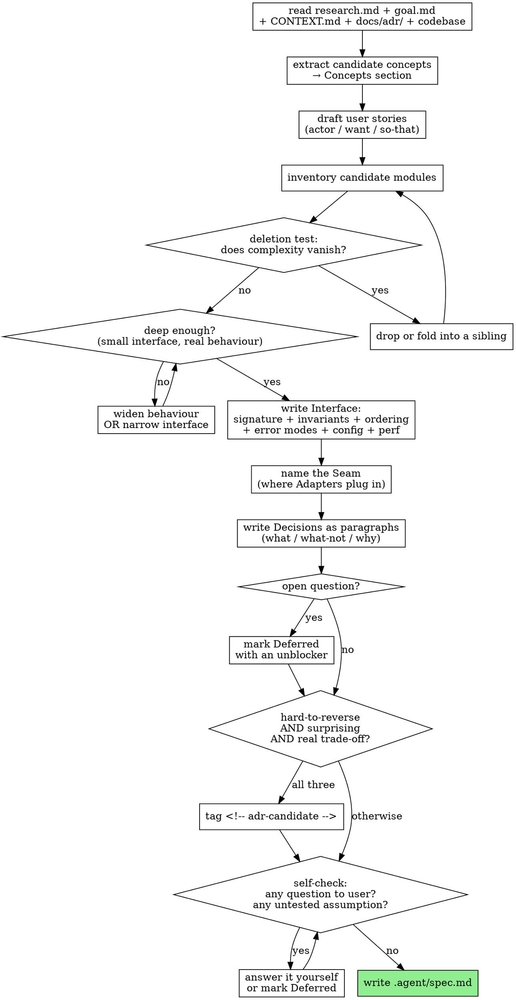

# arianna-spec

## Operating idea

You synthesize what is already known. You do not interview. Phase 0 (`arianna-research`) and Phase 1 (`goal.md`) collected the inputs; your job is to fold `.agent/research.md`, `.agent/goal.md`, the codebase, and any pre-existing `CONTEXT.md` / `docs/adr/` into a single coherent `.agent/spec.md`. The interview happens later, in `arianna-grill`, after `arianna-critique` has surfaced what synthesis alone cannot.

If your draft asks the user a question, you are doing `arianna-grill`'s job. Remove the question, decide one way, and mark the loser as deferred with an unblocker if it might come back.

## Workflow



The graph is the contract. The text below is supplement.

## Output shape

`.agent/spec.md` has exactly these four sections, in order:

```
# Spec: <project>

## Concepts        # vocabulary that names the domain
## User Stories    # actor / want / so-that, behavioural
## Decisions       # paragraphs, not formal ADRs
## Modules         # Name / Interface / Seam / Depth / Deletion-test
```

If a section would be empty, write `_None yet._` and leave a one-line reason. Empty sections are signal, not noise.

## Core vocabulary

Define each term once in the Concepts section, in this style. `_Avoid_:` is optional — include it only when the avoided word carries information loss.

| Term | One-line definition |
|---|---|
| Module | Anything with an interface and an implementation. Scale-agnostic — a function, a class, a service, a process can all be modules. |
| Interface | Every fact a caller must know: signature, invariants, ordering guarantees, error modes, configuration, performance characteristics. |
| Seam | Where you can alter behaviour without editing in that place. |
| Depth | Leverage at the interface — a module is deep when a small interface fronts a lot of behaviour. |
| Adapter | A concrete thing that fills a slot at a seam. |
| Context | The named scope inside which `CONTEXT.md` terms mean what `CONTEXT.md` says. |
| Deletion test | Imagine deleting the module; if complexity vanishes, it was not earning its keep. |

When a term in the Concepts section disagrees with a term already in `CONTEXT.md`, the `CONTEXT.md` term wins. Flag the conflict in your return JSON so `arianna-grill` can reconcile.

## Decisions are paragraphs

Each decision is 3–6 sentences in prose form: what was chosen, what was rejected, and why the trade-off was acceptable. No `Status:` / `Considered Options:` / `Consequences:` headers — those belong to formal ADRs, which you do not write.

Only promote a decision to an ADR candidate when **all three** hold:

1. **Hard to reverse** — changing it later costs a migration, not a refactor.
2. **Surprising** — a new reader would not guess it from the code.
3. **Real trade-off** — there was a credible alternative you rejected for stated reasons.

Mark candidates inline with `<!-- adr-candidate -->` at the end of the paragraph. `arianna-grill` decides whether to promote them to `docs/adr/NNNN-<slug>.md`.

## Modules section

For every module, write five lines:

- **Name** — the noun in the codebase or the noun the codebase should adopt.
- **Interface** — every caller-fact, not just the type signature. Include invariants, ordering, error modes, configuration, and performance characteristics where they matter.
- **Seam** — the named extension point (or "no seam yet — single adapter").
- **Depth justification** — one sentence on why the interface is small relative to the behaviour behind it. If it is not, the module is shallow; say so and either deepen it or fold it into a sibling.
- **Deletion-test outcome** — what complexity goes away if this module disappears. If the answer is "nothing meaningful," the module fails the test; drop it.

## Inputs you are allowed to read

- `.agent/research.md` — research findings.
- `.agent/goal.md` — problem, outcome, acceptance criteria, non-goals.
- `CONTEXT.md` at the repo root — existing shared language. Treat as authoritative.
- `docs/adr/*.md` at the repo root — existing architectural decisions. Treat as authoritative.
- The codebase itself, for facts you cannot get from the above.

You do not read prior `spec.md` rounds. Each Phase 2a run is fresh; revision happens because `arianna-critique` returned `REVISED` with notes attached, and those notes are folded into your inputs for the next run.

## Return JSON

The last block of your reply is a single JSON object:

```json
{
  "phase": "2a-spec",
  "status": "done",
  "files_changed": [".agent/spec.md"],
  "concepts_count": <int>,
  "stories_count": <int>,
  "decisions_count": <int>,
  "modules_count": <int>,
  "adr_candidates": <int>,
  "deferred_questions": <int>,
  "context_md_conflicts": [<term>...]
}
```

## Anti-patterns

- **Asking the user a question.** Synthesize or defer with an unblocker. Questions are `arianna-grill`'s output, not yours.
- **Writing formal ADR headers** (`Status: accepted`, `Considered Options:`, `Consequences:`). Decisions are paragraphs.
- **Shallow modules.** A wrapper that adds one parameter is not a module. Run the deletion test before adding it.
- **Restating the type signature as the Interface.** Interface includes invariants, ordering, error modes, configuration, performance — the caller-facts.
- **Listing decisions you did not actually make.** If the input already settled it, it is not a decision; it is a fact for the Concepts section.
- **Reading prior `spec.md` rounds.** Critique notes come in via the dispatch prompt; the previous file is not your input.

## References

- `../arianna-magic/SKILL.md` — orchestrator that dispatches you and the rest of Phase 2.
- `../arianna-critique/SKILL.md` — the stateless critic that runs after you, up to three rounds.
- `../arianna-grill/SKILL.md` — the interactive grill that runs after critique converges and owns the user interview.
