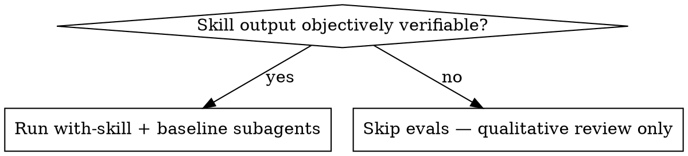

# Creating Skills

A skill for creating new skills and iteratively improving them, merged from Anthropic's `skill-creator` and OpenAI's Codex `skill-creator`. Targets both Codex and Claude Code; runtime-specific extras live in `references/`.

## The Loop

1. Decide what the skill should do, with concrete examples.
2. Plan reusable contents (scripts, references, assets).
3. Draft SKILL.md.
4. Run test prompts with-skill and (when subagents are available) baseline.
5. Review qualitatively + quantitatively, edit, repeat.
6. Validate, then optionally optimize the description.

Figure out where the user is in this loop and jump in there. If they say "vibe with me, no evals," do that. If they hand you a draft, go straight to eval/iterate.

## Core Principles

### Concise is key

The context window is a public good. **Codex/Claude is already smart.** Only add context the model doesn't already have. Challenge each paragraph: does it justify its tokens? Prefer short examples over long explanations.

### Set appropriate degrees of freedom

Match specificity to fragility:

- **High freedom (prose):** multiple approaches valid, decisions are contextual.
- **Medium freedom (pseudocode, parameterized scripts):** preferred pattern with acceptable variation.
- **Low freedom (specific scripts, fixed sequence):** fragile or error-prone operations where consistency matters.

Narrow bridge → guardrails. Open field → many routes.

### Explain the why

Avoid heavy MUSTs and rigid templates when prose will do. If you're typing ALWAYS or NEVER in caps, that's a yellow flag — explain *why* the rule exists so the model can generalize. This is more humane and more effective than rote enforcement.

**Lead each major section with one sentence answering "why does this matter" before listing patterns.** A reader skimming should know the stakes before reaching the techniques. "DDD is strategic before tactical — skipping the strategic step produces tactically-correct code that models the wrong thing" beats jumping straight into "## Bounded Context".

## Anatomy of a Skill

```
skill-name/
├── SKILL.md             # required
├── agents/              # optional, Codex-specific UI metadata
│   └── openai.yaml
├── scripts/             # executable code (deterministic / repetitive)
├── references/          # docs loaded on demand
└── assets/              # files used in output (templates, fonts, icons)
```

### SKILL.md frontmatter

Two required fields:

- **name** — kebab-case, ≤64 chars, matches parent directory.
- **description** — capability sentence + trigger sentence. Both runtimes match on this. Stay under 1024 chars for portability (Codex allows ~8k, Anthropic spec caps at 1024).

```yaml
---
name: skill-name
description: <Capability sentence.> Use when <concrete triggers — symptoms, file types, user phrases>. Do not use for <boundary>.
---
```

**Be a little pushy on triggers.** Models tend to *under*trigger; describe adjacent contexts where the skill should still fire even when not named explicitly. **Never summarize the workflow** — that creates a shortcut where the model follows the description and skips the body. A capability statement ("drives implementation with TDD") is fine; a step list ("first writes test, then watches it fail, then writes code") is not.

### Progressive disclosure

Three loading levels:

1. **Metadata** (name + description) — always in context.
2. **SKILL.md body** — loaded when the skill triggers (<500 lines, ~5k words).
3. **Bundled resources** — loaded only when the skill points at them.

If SKILL.md approaches 500 lines, split into `references/` and tell the body when to load each file. Keep references one level deep; for files >100 lines, include a table of contents.

For multi-variant skills, organize references by variant:

```
cloud-deploy/
├── SKILL.md         # workflow + provider selection
└── references/
    ├── aws.md
    ├── gcp.md
    └── azure.md
```

### What to leave out

A skill should only contain files that directly support its function. **Don't add** README.md, INSTALLATION.md, QUICK_REFERENCE.md, CHANGELOG.md, or any meta-documentation about how the skill was built. The skill is for an agent to do a job, not for humans browsing the repo.

## Creation Process

### Step 1 — Capture intent with concrete examples

Pull from the conversation first if the user has been doing the workflow already. Then ask:

1. What should this skill enable the agent to do?
2. When should it trigger? (user phrases, file types, contexts)
3. What's the expected output?
4. Should we set up evals? Skills with verifiable outputs (transforms, extractions, generated configs) benefit. Subjective skills (writing style, design taste) usually don't.

Don't fire off six questions in one message. Ask the most important ones, follow up.

### Step 2 — Plan reusable contents

For each example, ask: "What would I write from scratch every time?" That's a candidate `scripts/` or `assets/` entry. "What knowledge would I rediscover every time?" That's a `references/` candidate.

### Step 3 — Initialize

```bash
scripts/init_skill.py <skill-name> --path <output-dir> [--resources scripts,references,assets] [--examples]
```

This creates the directory, a SKILL.md template, and (for Codex) `agents/openai.yaml` from values you pass via `--interface key=value`. Generate `display_name`, `short_description`, and `default_prompt` by reading the drafted skill — see `references/openai_yaml.md`.

If `init_skill.py` isn't available in the target runtime, create the layout by hand following the Anatomy section.

### Step 4 — Write SKILL.md

Imperative voice. Frontmatter first, body second.

**Body sections** (omit what doesn't apply; order them by what the agent encounters first when applying the skill):

- **Operating idea / why this matters** — 1-2 sentences naming the stakes. Required.
- **When to use** — only if the description can't carry the cues (e.g., file paths, error signatures, command-line symptoms). Don't restate the description's trigger phrases here.
- **Patterns / implementation** — concrete code, inline for simple, linked file for heavy. Each pattern leads with one sentence on *why* before showing the *what*.
- **Decision table** — close decision-heavy skills (multiple tools, modes, or tradeoffs) with a `Need → Reach for` matrix. Skip if the skill has one obvious path.
- **Diagnostic order** — for skills triggered by symptoms ("X is slow / broken / wrong"), list checks in priority order. Cheap before expensive, common before rare.
- **Verification** — for skills about modeling, refactoring, or design, end with 2-3 concrete checks the agent can run on its own output. "Delete the database and rerun the domain tests — if they need a DB, the domain depends on infrastructure."
- **Common anti-patterns + fixes** — the failure modes you'd warn a reviewer about.
- **References** — pointers to `references/` with explicit "read when X" guidance.

**Same-bundle file references** use relative paths from the skill root, no `@` prefix:

```markdown
For pressure scenarios, see `references/testing-with-subagents.md`.
Run the validator: `bash scripts/validate.sh "$INPUT_FILE"`.
```

**Cross-skill references** name the target plainly (`see the tdd-mutation skill`) — plugin-style prefixes like `agents-skills:tdd-mutation` only resolve in Claude Code with the matching plugin manifest.

### Step 5 — Run test cases

Save 2-3 realistic prompts to `evals/evals.json` (full schema in `references/schemas.md`). Don't write assertions yet — draft them while runs are in progress.

```json
{
  "skill_name": "example-skill",
  "evals": [
    {"id": 1, "prompt": "User's task prompt", "expected_output": "Description", "files": []}
  ]
}
```

**With subagents available (Codex, Claude Code):**

For each eval, spawn two subagents *in the same turn* — one with the skill, one without (or with the prior version when iterating). Save outputs to `<skill>-workspace/iteration-N/eval-<id>/{with_skill,without_skill}/outputs/`.

Capture `total_tokens` and `duration_ms` from the subagent completion notification into `timing.json` — this is the only chance to record it.

**Without subagents:** Read the SKILL.md, follow it yourself on each test prompt, present the outputs in conversation. Less rigorous (you're both author and runner) but the human review compensates.

### Step 6 — Grade and review

1. Run the grader against assertions → `grading.json` with fields `text`, `passed`, `evidence` per assertion.
2. Aggregate: `python -m scripts.aggregate_benchmark <workspace>/iteration-N --skill-name <name>` produces `benchmark.json` and `benchmark.md` with mean ± stddev pass rate, time, tokens.
3. Launch the viewer: `python <creating-skills-path>/eval-viewer/generate_review.py <workspace>/iteration-N --skill-name "<name>" --benchmark <workspace>/iteration-N/benchmark.json`. Headless? Add `--static <out>.html` for a downloadable review file; feedback exports to `feedback.json`.
4. Read `feedback.json` when the user says they're done.

Don't write boutique HTML for review — use `generate_review.py`.

### Step 7 — Improve

Read transcripts, not just outputs. Look for:

- **Generalize from feedback.** The skill will run a million times across prompts you'll never see. Avoid overfitty fixes — branch out, try different metaphors, recommend different patterns.
- **Keep the prompt lean.** If a section makes the agent waste time, delete it and rerun.
- **Repeated work = bundle it.** If three subagents independently wrote `create_docx.py`, write it once, drop in `scripts/`, point the skill at it.

### Step 8 — Validate

```bash
scripts/quick_validate.py <path/to/skill-folder>
```

Checks YAML frontmatter, required fields, naming rules. Fix and rerun until clean.

Packaging-only. If you reached here without doing Steps 4–7 (test prompts, grade, iterate), the skill isn't done — only the bundle shape is. Go back unless the user said "no evals."

## Description Optimization (optional)

The description is the entire triggering surface. After the skill is otherwise stable, offer to tune it.

1. Generate ~20 realistic eval queries (8-10 should-trigger, 8-10 should-not-trigger). Mix phrasings, lengths, casual/formal. Negative cases must be **near-misses** that share keywords — easy negatives test nothing.
2. Review the eval set with the user via `assets/eval_review.html` (replace placeholders, write to a temp HTML, open it). The user edits and exports `eval_set.json`.
3. Run the optimization loop:
   ```bash
   python -m scripts.run_loop \
     --eval-set <path-to-eval.json> \
     --skill-path <path-to-skill> \
     --model <model-id> \
     --max-iterations 5 --verbose
   ```
   It splits 60/40 train/test, evaluates each query 3× per iteration, proposes new descriptions, picks the best by *test* score (not train) to avoid overfitting.
4. Apply `best_description` to SKILL.md.

**Triggering reality:** simple one-step queries ("read this PDF") may not consult any skill regardless of description quality — the model handles them directly. Make eval queries substantive enough that consulting a skill would actually help.

## Diagrams: graphviz dot for non-obvious decisions

Use a small inline `dot` digraph **only** when the skill has a decision point where the agent might go wrong — when-to-use-A-vs-B, process loops where the agent might stop early. Don't use dot for reference material (tables), code (fenced blocks), or linear instructions (numbered lists).



Why dot: renders cleanly to SVG, source is grep-able and diff-friendly, and labels carry semantic meaning unlike screenshot diagrams.

**Conventions:** see `references/graphviz-conventions.dot` for shape and label rules — diamonds for decisions, boxes for actions, no generic `step1` / `helper2` labels.

**Render for your human partner:**

```bash
scripts/render-graphs.js path/to/skill           # render each diagram separately to SVG
scripts/render-graphs.js path/to/skill --combine # all diagrams into one SVG
```

## Common Anti-Patterns

- **Workflow leak in description** — model follows the description, skips the body. Capability + triggers only.
- **Multi-language dilution** — one excellent example beats five mediocre ones in five languages. Pick the most natural language for the domain.
- **Term drift** — agent / Claude / model / Codex used interchangeably. Pick one term per concept.
- **Time-sensitive instructions** — "before August 2025, use the old API" rots silently. Keep current guidance current; collapse legacy notes into `<details>` blocks.
- **Generic flowchart labels** — `step1`, `helper2` — labels should carry semantic meaning or get replaced with prose.
- **Auxiliary docs in the bundle** — README.md, CHANGELOG.md, "how this skill was built" notes. The skill is for an agent doing a job.

## References

- `references/schemas.md` — full JSON schemas for `evals.json`, `grading.json`, `benchmark.json`, `eval_metadata.json`.
- `references/openai_yaml.md` — `agents/openai.yaml` field definitions and constraints.
- `references/rationalizations.md` — common excuses for skipping evals, with the resolution.
- `agents/grader.md` — assertion grading procedure for the grader subagent.
- `agents/analyzer.md` — pattern surfacing across runs (non-discriminating assertions, flaky evals, time/token tradeoffs).
- `agents/comparator.md` — blind A/B comparison between two skill versions when you need rigor beyond eyeballing.
