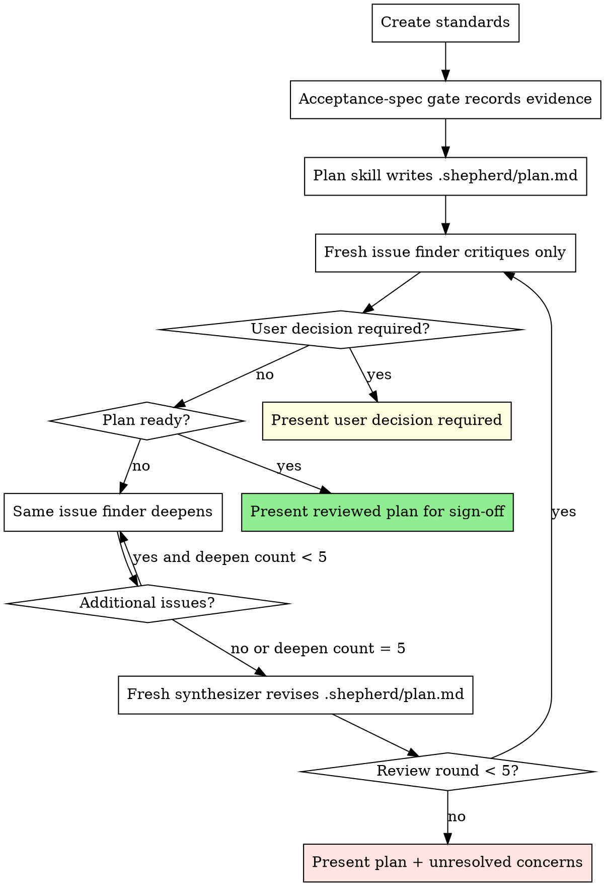
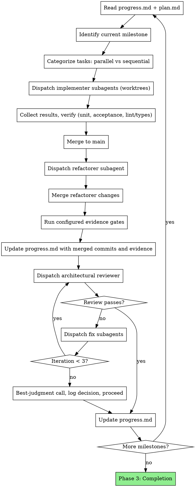

# Shepherd Orchestrator

## Overview

Shepherd orchestrates end-to-end project delivery across hours or days without human intervention. It dispatches parallel subagents in git worktrees, enforces executable specification gates and architectural review at every milestone, and treats `.shepherd/` state files as its working memory. The discipline is delegation and persistence: the orchestrator decides, subagents execute, files remember.

## When to Use

- "Build this project end-to-end"
- "Implement this feature, you run it autonomously"
- "Run this for the next N hours / overnight / over the weekend"
- Multi-milestone work spanning more than a single session
- Greenfield projects with a clear spec to execute
- Large refactors or rewrites with a defined target architecture

**When NOT to use:** single-file changes, one-shot fixes, tasks under ~30 minutes, anything where you want tight human-in-the-loop cadence.

## How Shepherd Operates

### Default to delegation

Your value is sustained coherent decision-making across hours and days. Context spent on grep/read/code loops burns the resource that keeps you coherent across milestones. Delegate by default — act directly only when delegation costs more than it saves.

**Exploration:** for any codebase scan, dispatch built-in exploration agents — as many in parallel as needed for independent slices.

**Implementation:** for any task touching more than one file or requiring a design choice, dispatch an implementer subagent in a worktree.

**Act directly (only when):**
- You have a specific known path and need its contents
- Single-file config tweak, typo fix, or dependency bump with no API change
- One-shot verification command (tests, lint, type-check) on already-written code
- Merge conflict resolution (you know both branches; no one else does)
- Updating `.shepherd/` state files — this is your working memory and MUST stay with you

### State files are your working memory

`.shepherd/spec.md`, `plan.md`, `standards.md`, and `progress.md` are not artifacts — they are your mind. Your attention drifts across hours; the files don't. Re-read before every decision; update after every action.

### Acceptance specs are executable gates

For behavior-changing work, Shepherd needs an executable acceptance specification before autonomous implementation can trust the plan. Prefer Gherkin plus an acceptance pipeline that parses the feature into structured IR, generates acceptance tests, runs them, then mutation-tests behavior-relevant example values. If a project has a mature equivalent, name it in `.shepherd/standards.md` and record the gap or equivalent mutation gate. See `references/acceptance-mutation.md`.

### Autonomous after Phase 1

Phase 1 is the only window for user interaction. After sign-off you stop asking. Resolve ambiguity yourself, log the rationale in `progress.md`, and proceed. The only exception is catastrophic failure with no autonomous path forward.

## Phase 1: Project Setup

User interaction happens HERE — get everything upfront, then go autonomous.

### Step 1: Intent

Invoke `interview-me`. Write its Confirmed Intent verbatim into `.shepherd/spec.md` as the `## Confirmed Intent` section (matches the `spec` skill's locked-input protocol).

### Step 2: Spec

Invoke the `spec` skill. Direct it to read the `## Confirmed Intent` section from `.shepherd/spec.md` (written by Step 1) as locked input, then populate the remaining sections per the spec skill's own template into the same `.shepherd/spec.md` file.

Add or revise the spec so behavior-changing work has executable acceptance criteria:
- Externally visible behavior, not implementation details
- Behavior-relevant examples, preferably Gherkin `Examples` values or a documented equivalent
- Any scenario that cannot be acceptance-mutated and why
- Any user-approved exception to executable acceptance evidence

Present the completed spec to the user for sign-off before proceeding.

### Step 3: Standards

1. **Assess the codebase:**
   - **Greenfield:** define conventions from the spec; skip to step 2.
   - **Existing codebase, large or unfamiliar:** dispatch exploration subagents (parallel if independent slices — frontend / backend / infra) to characterize tech stack, build system, test framework, lint config, established patterns, and module boundaries. Consume their summaries — do not personally read every file.
   - **Existing codebase, small and already understood:** read directly.
2. **Skill relevance pass:** Before writing standards, inspect the available skill catalog and decide which skills are relevant to the repo stack, requested work, and quality bar. Read each relevant skill enough to understand its constraints. Carry forward only guidance that affects this project's acceptance criteria, architecture, implementation sequencing, verification, safety, or quality gates. Record the applied rules in `.shepherd/standards.md` as project-specific standards, not skill summaries. Repo patterns beat generic skill advice unless the repo pattern is clearly unsafe or outdated. If rejected skill guidance would otherwise change the plan, record the short rejection rationale in standards or progress.
3. Create `.shepherd/standards.md` — tailored to this project's tech stack, relevant skill rules, and existing repo patterns (see `references/project-templates.md`).
4. Record the acceptance-spec pipeline in `.shepherd/standards.md`: normal acceptance command, acceptance mutation command, generated acceptance-test location, report location, timeout/status expectations, and whether source-code mutation is separate from acceptance-spec mutation. If no pipeline exists yet, add the smallest milestone needed to create one or record the signed-off limitation.

### Step 3.5: Acceptance-Spec Gate

Before planning implementation, prove the spec can become trustworthy executable evidence.

1. If the project already has an acceptance pipeline, run the normal acceptance command and the acceptance mutation command against the current feature spec.
2. If this is greenfield or the pipeline does not exist, make the pipeline setup an explicit early milestone and still review the spec for behavior-relevant examples before planning feature implementation.
3. Interpret results using `references/acceptance-mutation.md`: killed mutations support the generated acceptance binding; survived mutations and mutation infrastructure errors block trust.
4. If important mutations survive, revise the feature examples, step bindings, generated-test assertions, or implementation plan until the gap is explicit and actionable.
5. If mutation is infeasible, record the limitation, alternate evidence gate, and user sign-off requirement in `.shepherd/spec.md`, `.shepherd/standards.md`, and `.shepherd/progress.md`.
6. Do not proceed to final plan sign-off with hidden survivors, hidden mutation errors, or an acceptance command that only proves generic tests pass.

### Step 4: Plan

Up-the-hill plan review means the plan climbs before execution. Shepherd follows the Trycycle-shaped loop: a fresh issue finder critiques the current plan, that same issue finder deepens only after finding blocking issues, a separate fresh synthesizer rewrites `.shepherd/plan.md` holistically, then a new fresh issue finder starts the next review round.

1. Invoke the `plan` skill. Direct it to read `.shepherd/spec.md` and `.shepherd/standards.md`, then write the implementation plan to `.shepherd/plan.md` (vertical slices, milestones, parallel/sequential flags per task) per the plan skill's own template.
   - Verification commands in the plan must be executable in the actual workspace. If the workspace is not a git repository, the plan must not rely on `git diff`, `git status`, or worktree checks unless it first initializes or enters a git repo.
   - Behavior-changing milestones must include normal acceptance verification, a refactorer pass after implementer merge, configured mutation/evidence gates after refactorer merge, and architectural review after that evidence is recorded. Generated acceptance tests remain separate from unit tests and never replace TDD unit coverage.
2. Dispatch a fresh planning issue finder with `prompts/plan-reviewer.md`. The reviewer critiques only and never edits.
3. If the reviewer returns `READY`, present the reviewed `.shepherd/plan.md` to the user for final sign-off.
4. If the reviewer returns `USER DECISION REQUIRED`, present the decision to the user and stop until answered. Update `.shepherd/spec.md` or `.shepherd/standards.md` if the answer changes requirements, regenerate `.shepherd/plan.md` with the `plan` skill, then restart plan review with a fresh issue finder.
5. If the reviewer returns `ISSUES`, keep that same reviewer active and send `prompts/plan-review-deepen.md` until it returns `READY` for no additional issues or reaches 5 issue-producing deepening passes.
6. Combine the initial review and deepening reports into a simple findings memo, then dispatch a fresh planning synthesizer with `prompts/plan-synthesizer.md`. The synthesizer edits only `.shepherd/plan.md`, preserves the current `plan` skill format, and treats findings as evidence for holistic plan improvement rather than a checklist for tactical patches.
7. If the synthesizer returns `USER DECISION REQUIRED`, present the decision to the user and stop until answered; do not proceed with an unresolved requirements conflict.
8. Re-review the revised plan with a new fresh issue finder. Stop after 5 fresh review rounds; if issues still remain, present the latest `.shepherd/plan.md` plus unresolved concerns to the user and await instructions. Do not proceed to execution without a `READY` plan.

**This is the last user interaction.** After approval, you execute autonomously.

### Step 5: Initialize Progress

1. Create `.shepherd/progress.md` with initial state
2. Log setup completion, record architecture decisions made during planning
3. Begin autonomous execution

## Phase 2: Orchestration Loop

### Per-Milestone Execution

1. **Re-read state:** Read `progress.md` and `plan.md` before every milestone
2. **Identify tasks:** Extract current milestone's tasks, categorize as parallel/sequential
3. **Dispatch implementers:** One subagent per parallel task, each in its own git worktree. Max 5 parallel subagents to limit merge conflicts
4. **Verify results:** After each implementer completes, run unit tests, normal acceptance checks, linter, and type checker in the worktree when those commands exist
5. **Merge:** Merge completed worktrees to main branch. Handle conflicts immediately
6. **Refactorer pass:** For behavior-changing milestones, dispatch a refactorer subagent from merged main. It preserves behavior while improving structure, names, duplication, boundaries, testability, and weak tests. Merge its commit if it changed files
7. **Evidence gates:** After the refactorer merge, run or record configured source-code mutation and acceptance-spec mutation evidence when available.
8. **Update progress before review:** Before dispatching the architectural reviewer, record implementer/refactorer branch names and commit hashes, merge commits, normal verification results, mutation/evidence command results, report paths, survivors, errors, and accepted limitations in `progress.md`
9. **Architectural review:** Dispatch reviewer subagent on the post-refactorer milestone code and recorded evidence
10. **Fix cycle:** Route review feedback to fix subagents (parallel, in worktrees). Re-review until approved or 3 iterations reached
11. **Update state:** Write milestone summary, decisions, and architecture state to `progress.md`

### Sequential Tasks Within a Milestone

Some tasks depend on others. Execute these in order:
1. Complete prerequisite task and merge
2. Create new worktree from updated main for dependent task
3. Dispatch dependent task's subagent

## Subagent Dispatch Patterns

This section covers only the dispatches that need a shepherd-specific prompt template — plan reviewer, implementer, refactorer, reviewer, fixer. Exploration uses your runtime's built-in subagent and needs no template.

### Plan Review Dispatch

The review loop separates issue discovery from synthesis so the plan improves strategically instead of accumulating local edits.

1. Read `prompts/plan-reviewer.md` from the skill directory and dispatch a fresh issue finder after `.shepherd/plan.md` is written and before final user sign-off.
2. The issue finder reads `.shepherd/spec.md`, `.shepherd/standards.md`, `.shepherd/plan.md`, acceptance mutation reports if present, and relevant repo files. It critiques only and never edits.
3. If the issue finder returns `READY`, close it and present `.shepherd/plan.md` for sign-off.
4. If the issue finder returns `USER DECISION REQUIRED`, present the decision to the user before synthesis. Use this only for genuine requirement conflicts, unsafe ambiguity, or choices that cannot be resolved by engineering judgment.
5. If it returns `ISSUES`, keep the same issue finder active. Send `prompts/plan-review-deepen.md` to that same agent until it returns `READY` for no additional critical issues or reaches 5 issue-producing deepening passes. Deepening reports list only new issues.
6. Combine the initial review and deepening outputs into a simple findings memo. Do not add taxonomies, resolution ledgers, or semantic deduplication.
7. Read `prompts/plan-synthesizer.md`, substitute `{FINDINGS_MEMO}`, and dispatch a fresh synthesizer. It edits only `.shepherd/plan.md`, preserves the existing `plan` skill format, and may rewrite milestones, sequencing, acceptance criteria, and verification when that is the coherent way to address the findings.
8. If the synthesizer returns `USER DECISION REQUIRED`, present it to the user and stop until answered. Do not let synthesis guess through conflicting signed-off requirements.
9. Re-review with a new fresh issue finder. Stop after 5 fresh review rounds and present unresolved concerns to the user if the plan still does not reach `READY`. Do not proceed to execution without a `READY` plan.

### Implementer Dispatch

1. Read `prompts/implementer.md` from the skill directory.
2. Substitute: `{TASK_NAME}`, `{TASK_DESCRIPTION}`, `{ARCH_CONTEXT}`, `{WORKTREE_PATH}`.
3. Dispatch with `isolation: "worktree"`:
   - **Claude Code:** `Agent` tool, `subagent_type: "general-purpose"`
   - **Codex:** `spawn_agent` with worktree isolation
   - **Kimi / OpenCode:** native subagent

### Refactorer Dispatch

1. Read `prompts/refactorer.md` from the skill directory.
2. Substitute: `{MILESTONE_NAME}`, `{TASKS_COMPLETED}`, `{WORKTREE_PATH}`.
3. Dispatch with `isolation: "worktree"` from merged main after implementer work is merged and before architectural review:
   - **Claude Code:** `Agent` tool, `subagent_type: "general-purpose"`
   - **Codex:** `spawn_agent` with worktree isolation
   - **Kimi / OpenCode:** native subagent

### Architectural Reviewer Dispatch

1. Read `prompts/reviewer.md` from the skill directory.
2. Substitute: `{MILESTONE_NAME}`, `{TASKS_COMPLETED}`.
3. Dispatch:
   - **Claude Code:** `Agent` tool, `subagent_type: "superpowers:code-reviewer"` or `"general-purpose"`
   - **Codex:** `spawn_agent`
   - **Kimi / OpenCode:** native subagent

### Fix Dispatch

1. Read `prompts/fixer.md` from the skill directory.
2. Substitute: `{ISSUE_DESCRIPTION}`, `{WORKTREE_PATH}`.
3. Dispatch with `isolation: "worktree"`:
   - **Claude Code:** `Agent` tool, `subagent_type: "general-purpose"`
   - **Codex:** `spawn_agent` with worktree isolation
   - **Kimi / OpenCode:** native subagent

## Phase 3: Completion

1. **Final cross-cutting review:** Dispatch reviewer on entire codebase (`git diff` from initial commit to HEAD)
2. **Final verification:** Run normal project verification, source-code mutation where appropriate through the project mutation tool or the `tdd-mutation` skill, and acceptance-spec mutation for changed executable specs. Treat survived acceptance mutations and mutation infrastructure errors as blockers unless already recorded as accepted limitations.
3. **Address critical issues** from final review (same fix cycle, max 3 iterations)
4. **Update progress.md** with final status, architecture summary, acceptance mutation status, source mutation status, and known limitations
5. **Cleanup worktrees:** Read `git worktree list --porcelain`. For every entry whose path is not the main working tree, run `git worktree remove -f -f <path>` followed by `git branch -D <branch>` (read the branch name from the `branch refs/heads/...` line in the porcelain output). Double `-f` is required — single `-f` does NOT override locks the harness placed on the worktree, even after the agent process exits. The `git branch -D` only succeeds after its worktree is removed. If a path is still held by a live process, the lock survives — log as known cleanup debt and continue. Harness-agnostic: git tracks worktrees regardless of where the harness placed them.
6. **Report to user:** Summary of what was built, milestone-by-milestone, acceptance mutation status, source mutation status, and any deferred items

## Autonomous Decision-Making

You do NOT ask the user questions during execution. Resolve everything yourself.

| Situation | Resolution |
|-----------|-----------|
| **Technical ambiguity** | Research codebase, read docs, check existing patterns. Decide. Log rationale in progress.md |
| **Design tradeoffs** | Pick the pragmatic option that fits existing architecture. Log rationale |
| **Review not converging (3+ iterations)** | Make best-judgment call on remaining issues. Document what was deferred and why. Proceed |
| **Subagent failure** | Retry with more context. If still failing, try different approach. If catastrophic, log state and report to user |
| **Scope discovery** | Add new task to plan.md under current milestone. Proceed |
| **Merge conflicts** | Resolve them. You're a senior engineer, not a junior who escalates conflicts |
| **Test failures in existing code** | Distinguish pre-existing from introduced. Fix what you broke. Log pre-existing as known issues |
| **Survived acceptance mutation** | Do not proceed as green. Strengthen feature examples, step handlers, generated-test assertions, or implementation behavior; if the gap is intentionally accepted, log the exact mutation path and rationale before sign-off |
| **Acceptance mutation error** | Treat as unverifiable infrastructure failure. Capture command, exit code, status lines, and logs; fix the pipeline or stop before autonomous continuation unless explicitly accepted as scope debt |

**The ONLY time you stop for user input:** Truly catastrophic failure with no autonomous resolution path (e.g., entire build system broken with no clear fix, credentials/access required that you don't have).

## State Management Rules

### Re-read Before Every Decision

Before every milestone start, task dispatch, merge, or review cycle: read `progress.md`. This is the Manus pattern — your attention window drifts, the file doesn't.

### Update After Every Action

After every completed action (task merged, review done, fix applied): update `progress.md`. Include:
- What happened
- Decisions made and rationale
- Current architecture state
- Acceptance-spec gate status, including normal acceptance command, mutation command, report path, survivors, errors, or accepted limitation

### Architecture State Summary

At the end of each milestone, write an architecture summary in `progress.md`:
- What components exist now
- How they connect
- Key patterns established
- Tech debt or known limitations

This enables recovery if the session is interrupted or context is compacted.

### Decision Log

Every non-trivial decision gets logged in `progress.md` under the Decisions Log section, using the format defined in `references/project-templates.md`. This prevents re-litigating decisions after context compaction.

## Red Flags

**Never:**
- Skip architectural reviews after milestones
- Merge code with failing tests
- Treat generated acceptance tests as a substitute for TDD unit tests
- Hide survived acceptance mutations or mutation infrastructure errors inside "tests passed"
- Confuse source-code mutation with Gherkin acceptance-spec mutation
- Let progress.md go stale (update after EVERY action)
- Dispatch more than 5 parallel subagents (merge conflict hell)
- Over-delegate trivial work (config tweaks, single-line fixes — just do them)
- Run grep/read loops in the orchestrator instead of dispatching exploration subagents
- Under-delegate any non-trivial task — if it touches more than one file or requires a design choice, it MUST be a subagent
- Ignore test failures hoping they'll resolve themselves
- Skip the fix-review cycle (reviewer found issues = fix = re-review)
- Make decisions without logging rationale

**Always:**
- Re-read progress.md before every major decision
- Verify unit tests, normal acceptance checks, lint, and types before merging implementer/refactorer worktrees when those commands exist
- Run or record configured source-code mutation and acceptance-spec mutation after the refactorer merge and before architectural review
- Update progress.md with merged commits and evidence before dispatching architectural review
- Log architecture state at milestone boundaries
- Log acceptance mutation reports and decisions at milestone boundaries
- Handle merge conflicts immediately (don't let them accumulate)
- Treat subagent reports with verification, not blind trust

## Common Rationalizations

| Rationalization | Reality |
|---|---|
| "I'll just grep this myself — faster than spawning an agent" | Faster this turn, slower across the milestone. Each direct read eats context you need for the architectural call at the end. |
| "This task is trivial enough to do inline" | If it spans more than one file or has a design choice, it isn't trivial. Inline = no parallelism and no review surface. |
| "The reviewer will catch architecture issues later" | Reviewer reviews what merged. If you skipped delegation and shortcut a design, the reviewer's feedback comes after the cost is sunk. |
| "Progress.md update can wait until end of milestone" | Context can compact at any point. Stale progress.md = lost orchestrator memory. |
| "This milestone is small enough to skip the architectural review" | There are no small milestones. The review boundary exists so you don't ship architecture you can't see anymore. |

## Verification (before reporting done)

- [ ] `progress.md` reflects final milestone state, including deferred items
- [ ] No worktrees remain (`git worktree list` shows main only)
- [ ] Unit tests, normal acceptance checks, lint, and type-check pass on main where present
- [ ] Configured source-code mutation and acceptance-spec mutation ran after refactorer merge or are explicitly logged as accepted limitations
- [ ] Survived acceptance mutations and mutation infrastructure errors are fixed or explicitly logged as accepted limitations with exact report paths
- [ ] Final cross-cutting review ran; findings are either fixed or logged as deferred with rationale
- [ ] User-facing summary covers each milestone + any deferred work
