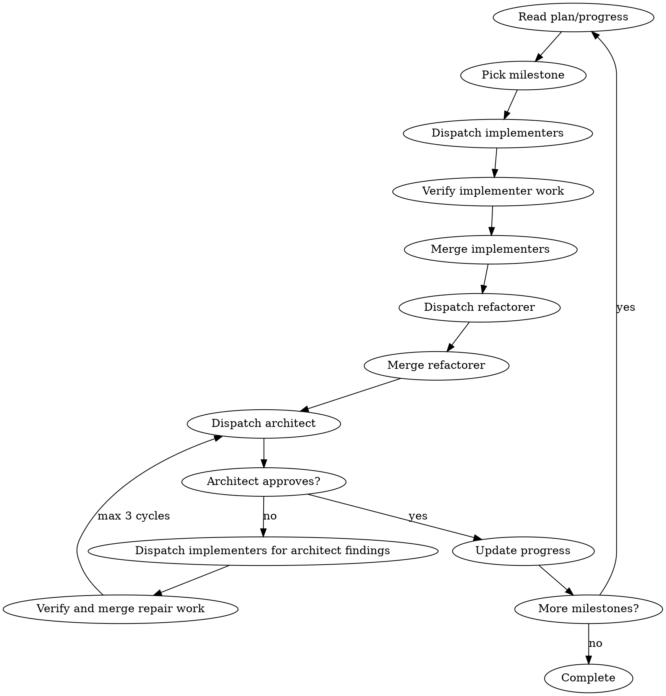

# Shepherd

## Gated Workflow

Shepherd has three ordered phases. It is forbidden to jump over a phase, reorder
steps, collapse steps, or mark a step complete until its artifact and validation
condition exist. If a gate cannot be satisfied, record the blocker or explicit
waiver in `.shepherd/progress.md` before moving on.

```text
SETUP
  1. Intent -> 2. Behavior Contract -> 3. Standards -> 4. Acceptance Pipeline Readiness -> 5. Plan -> 6. Setup Close
MILESTONE LOOP
  Implementers -> verify/merge -> refactorer -> architect -> repair loop if needed
COMPLETION
  Final architect hardening -> critical repair loop -> cleanup -> final report
```

## Use Shepherd When

- The work spans multiple milestones, hours, or days.
- The user asks for autonomous end-to-end delivery.
- Parallel implementation, refactoring, hardening, and architect-finding repair cycles are useful.

Do not use Shepherd for one-shot fixes, single-file edits, short debugging sessions, or work that needs tight user approval after every step.

## Operating Model

- You are the coordinator: own sequencing, dispatch, merges, and `.shepherd/*` state.
- State files are working memory: re-read them before decisions and update `.shepherd/progress.md` after actions.
- Delegate non-trivial implementation to worktree-isolated agents. Direct work is for trivial edits, one known file, one verification command, merge conflicts, and `.shepherd/` updates.
- Phase 1 is the user-interaction window. After sign-off, proceed autonomously unless there is no autonomous path forward.

## State Files

| File | Purpose |
|---|---|
| `.shepherd/spec.md` | Confirmed intent, user-visible behavior, acceptance criteria, examples, accepted exceptions. |
| `.shepherd/standards.md` | Project rules, relevant skill rules, role-owned commands, acceptance/source mutation evidence, waivers. |
| `.shepherd/plan.md` | Reviewed implementation plan from the `plan` skill. |
| `.shepherd/progress.md` | Current milestone, commits, evidence, decisions, architecture state, blockers, waivers. |

Use `references/project-templates.md` for `standards.md` and `progress.md`. The `spec` and `plan` skills own their own formats.

## Roles

| Role | Owns | Does Not Own |
|---|---|---|
| Coordinator | State, sequencing, dispatch, merges, progress evidence. | Implementation, normal acceptance pipeline work, refactoring, mutation, architectural hardening. |
| Implementer | Assigned behavior slice or architect finding, TDD unit tests, normal acceptance, normal acceptance pipeline components. | Broad cleanup, source mutation, acceptance-spec mutation, hardening. |
| Refactorer | Behavior-preserving cleanup after implementer merge: names, duplication, boundaries, testability, configured CRAP/DRY/property-test support. | New behavior, source mutation, acceptance-spec mutation. |
| Architect | Boundaries, dependency direction, mutation runner adapter, hardening tools, source mutation, acceptance-spec mutation, final verdict. | New product behavior, spec rewrite, broad implementation. |

## Phase 1: Setup

### 1. Intent

Create `.shepherd/progress.md` from `references/project-templates.md`, then invoke `interview-me`. Write the confirmed intent into `.shepherd/spec.md` under `## Confirmed Intent` and record setup start in progress.

### 2. Behavior Contract

Invoke `spec`. Direct it to use `.shepherd/spec.md` as locked input and complete the spec there.

For behavior-changing work, make the spec concrete enough to test:

- user-visible behavior only
- behavior-relevant examples, preferably executable examples or a documented equivalent
- mutation-relevant example values as parameters when acceptance-spec mutation is used
- explicit scenarios that cannot be acceptance-mutated
- explicit user-approved exceptions

Present the completed spec for sign-off.

### 3. Standards

Create `.shepherd/standards.md` from repo truth. Treat it as the project constitution for this run: exact commands, constraints, role ownership, and waivers.

1. Inspect the repo directly for small codebases; dispatch exploration agents for large or unfamiliar ones.
2. Inspect available skills and read only the relevant ones. Carry forward project-specific rules, not skill summaries.
3. Record project-specific verification commands and quality rules.
4. Map role-owned acceptance/source mutation commands: normal acceptance pipeline for implementers; mutation hardening, runner adapter, reports, timeouts, and waivers for architects.

### 4. Acceptance Pipeline Readiness

For behavior-changing work, prove or create the smallest executable acceptance pipeline before planning feature implementation. This gate exists so Shepherd cannot jump from spec text to code without knowing how approved behavior will be checked.

First record the readiness state:

1. `.shepherd/spec.md`: behavior-relevant examples, preferably executable examples, or a user-approved reason examples are impossible.
2. `.shepherd/standards.md`: parser/IR, generator, generated test location, runtime or step handler location, normal acceptance command, mutation runner adapter, mutation command, report paths, source mutation command when configured, and waivers.
3. `.shepherd/progress.md`: current status for examples, parser/IR, generator, runtime or step handlers, normal acceptance, mutation runner adapter, acceptance-spec mutation, source-code mutation, missing pieces, survivors/errors, and waivers.

Then choose one path:

- Existing pipeline: run enough to prove parser/IR, generator, runtime or step handlers, normal acceptance, mutation runner adapter, and report paths are real.
- Missing pipeline: record `implementer task required` for normal acceptance components and `architect task required` for mutation hardening, then require `.shepherd/plan.md` to schedule that setup before feature implementation.
- Infeasible pipeline: record the user-approved degraded-evidence waiver in `.shepherd/spec.md`, `.shepherd/standards.md`, and `.shepherd/progress.md` before planning.

Survived acceptance mutations, mutation errors, hidden setup failures, missing command placeholders, or generic tests masquerading as acceptance evidence block plan sign-off unless explicitly waived.

Do not invoke `plan`, present a final plan, or start implementation while acceptance-pipeline readiness is unrecorded or blocked.

### 5. Plan

Invoke `plan`. Direct it to read `.shepherd/spec.md` and `.shepherd/standards.md`, then write `.shepherd/plan.md`.

Shepherd-specific plan constraints:

- verification commands must be executable in the actual workspace
- behavior-changing milestones assign normal acceptance pipeline work to implementers and mutation hardening to architects
- behavior-changing milestones include implementer verification, refactorer pass, architect hardening, and architect-finding repair cycles
- generated acceptance tests never replace TDD unit coverage

If `plan` returns `USER DECISION REQUIRED`, stop and present the decision. If it returns `READY`, present `.shepherd/plan.md` for final sign-off.

### 6. Setup Close

Record setup completion, role-owned acceptance/mutation state, and architecture decisions in `.shepherd/progress.md`. Then execute autonomously.

## Phase 2: Milestone Loop



Per milestone:

1. Read `.shepherd/progress.md` and `.shepherd/plan.md`.
2. Categorize tasks as parallel or sequential.
3. Dispatch at most 5 parallel implementers in separate git worktrees.
4. Verify each implementer worktree with unit tests, normal acceptance, lint, and type checks when commands exist.
5. Merge passing implementer work. Resolve conflicts immediately.
6. Dispatch refactorer from merged main for behavior-changing milestones; merge if it changed files.
7. Dispatch architect from merged main. Architect runs configured hardening and may commit structural fixes.
8. Record branches, commits, verification, mutation reports, survivors, errors, waivers, and decisions in `progress.md`.
9. Dispatch implementers for exact architect findings, then verify and merge passing repair work. Re-run architect until approved or 3 repair cycles are reached.
10. Log milestone summary and architecture state.

Sequential tasks wait for their prerequisites to merge, then run from updated main.

## Dispatch Prompts

Use these prompt templates only for role dispatches that need Shepherd-specific context:

| Dispatch | Prompt | When |
|---|---|---|
| Implementer | `prompts/implementer.md` | Assigned behavior slice or architect finding. |
| Refactorer | `prompts/refactorer.md` | After implementer merge, before architect. |
| Architect | `prompts/architect.md` | After refactorer merge and at final hardening. |

Exploration uses the runtime's built-in exploration agent. Planning belongs to the `plan` skill.

## Phase 3: Completion

1. Dispatch architect for final hardening across the full diff.
2. Run the same implementer repair cycle for critical final findings, max 3 iterations.
3. Record final verification, source mutation, acceptance-spec mutation, waivers, and final verdict in `progress.md`.
4. Remove non-main git worktrees with `git worktree remove -f -f <path>`, then delete their branches.
5. Report what shipped, milestone evidence, mutation status, accepted limitations, and deferred work.

## Blockers

Do not proceed as green when any of these are true:

- verification fails and the failure is not recorded as pre-existing debt
- generated acceptance tests substitute for unit tests
- acceptance mutation has survivors or infrastructure errors without an explicit waiver
- source-code mutation has survivors or errors where configured without an explicit waiver
- normal acceptance pipeline work is missing from implementer scope for behavior-changing work without user-approved degraded evidence
- mutation runner adapter or mutation evidence is missing from architect hardening without user-approved degraded evidence
- architect requests changes and the implementer repair cycle has not run
- `.shepherd/progress.md` is stale
- sibling worktrees or branches are used without explicit coordinator naming

## References

- `references/project-templates.md`: use when creating `standards.md` or `progress.md`.
- `references/acceptance-mutation.md`: read when configuring or judging acceptance pipeline mechanics.
- `prompts/*.md`: load only when dispatching that role.
