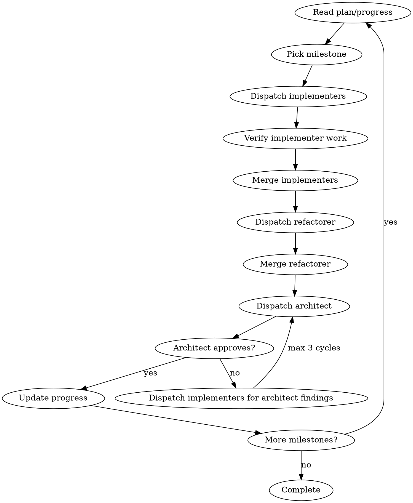

# Shepherd

Shepherd coordinates long-running delivery. Keep project state in `.shepherd/`, delegate role work to isolated agents, and use the architect pass to harden each milestone before moving on.

## Use Shepherd When

- The work spans multiple milestones, hours, or days.
- The user asks for autonomous end-to-end delivery.
- Parallel implementation, refactoring, hardening, and architect-finding repair cycles are useful.

Do not use Shepherd for one-shot fixes, single-file edits, short debugging sessions, or work that needs tight user approval after every step.

## Operating Model

- You are the coordinator. Own sequencing, dispatch, merges, and `.shepherd/*` state.
- Delegate non-trivial implementation to worktree-isolated agents. Direct work is for trivial edits, one known file, one verification command, merge conflicts, and `.shepherd/` updates.
- Re-read `.shepherd/progress.md` and `.shepherd/plan.md` before every milestone, dispatch, merge, repair cycle, and final report.
- Update `.shepherd/progress.md` after every action. Files are memory; chat context is disposable.
- After Phase 1 sign-off, stop asking questions unless there is no autonomous path forward.

## State Files

| File | Purpose |
|---|---|
| `.shepherd/spec.md` | Confirmed intent, user-visible behavior, acceptance criteria, examples, accepted exceptions. |
| `.shepherd/standards.md` | Project-specific quality rules, relevant skill rules, verification commands, acceptance/source mutation setup. |
| `.shepherd/plan.md` | Reviewed implementation plan from the `plan` skill. |
| `.shepherd/progress.md` | Current milestone, commits, evidence, decisions, architecture state, blockers, waivers. |

Use `references/project-templates.md` for `standards.md` and `progress.md`. The `spec` and `plan` skills own their own formats.

## Roles

| Role | Owns | Does Not Own |
|---|---|---|
| Coordinator | State, sequencing, dispatch, merges, progress evidence. | Implementation, refactoring, mutation, architectural hardening. |
| Implementer | Assigned behavior slice or architect finding, TDD unit tests, normal acceptance, assigned pipeline setup. | Broad cleanup, source mutation, acceptance-spec mutation, hardening. |
| Refactorer | Behavior-preserving cleanup after implementer merge: names, duplication, boundaries, testability. | New behavior, source mutation, acceptance-spec mutation. |
| Architect | Boundaries, dependency direction, hardening tools, source mutation, acceptance-spec mutation, DRY/complexity checks, verdict. | New product behavior, spec rewrite, broad implementation. |

## Phase 1: Setup

### 1. Intent

Invoke `interview-me`. Write the confirmed intent into `.shepherd/spec.md` under `## Confirmed Intent`.

### 2. Behavior Contract

Invoke `spec`. Direct it to use `.shepherd/spec.md` as locked input and complete the spec there.

For behavior-changing work, make the spec concrete enough to test:

- user-visible behavior only
- behavior-relevant examples, preferably executable examples or a documented equivalent
- explicit scenarios that cannot be acceptance-mutated
- explicit user-approved exceptions

Present the completed spec for sign-off.

### 3. Standards

Create `.shepherd/standards.md` from repo truth:

1. Inspect the repo directly for small codebases; dispatch exploration agents for large or unfamiliar ones.
2. Inspect available skills and read only the relevant ones. Carry forward project-specific rules, not skill summaries.
3. Record verification commands and quality rules.
4. Map acceptance/source mutation readiness: parser, IR, generator, generated tests, runner, normal acceptance, acceptance-spec mutation, source-code mutation, reports, timeouts, waivers.

### 4. Acceptance Pipeline Readiness

For behavior-changing work, prove or create the smallest acceptance pipeline before planning implementation.

- Existing pipeline: run enough to prove parser, IR, generator, runner, normal acceptance, and mutator are real.
- Missing pipeline: create or assign the smallest setup needed now.
- Greenfield behavior may fail normal generated tests before implementation, but parser/generator/runner/mutator infrastructure must report clearly.
- Survived acceptance mutations, mutation errors, hidden setup failures, or generic tests masquerading as acceptance evidence block plan sign-off unless explicitly waived.

Read `references/acceptance-mutation.md` when judging killed/survived/error results.

### 5. Plan

Invoke `plan`. Direct it to read `.shepherd/spec.md` and `.shepherd/standards.md`, then write `.shepherd/plan.md`.

Shepherd-specific plan constraints:

- verification commands must be executable in the actual workspace
- behavior-changing milestones include implementer verification, refactorer pass, architect hardening, and architect-finding repair cycles
- generated acceptance tests never replace TDD unit coverage

If `plan` returns `USER DECISION REQUIRED`, stop and present the decision. If it returns `READY`, present `.shepherd/plan.md` for final sign-off.

### 6. Progress Init

Create `.shepherd/progress.md`. Record setup completion, acceptance pipeline state, and architecture decisions. Then execute autonomously.

## Phase 2: Milestone Loop

Per milestone:

1. Read `.shepherd/progress.md` and `.shepherd/plan.md`.
2. Categorize tasks as parallel or sequential.
3. Dispatch at most 5 parallel implementers in separate git worktrees.
4. Verify each implementer worktree with unit tests, normal acceptance, lint, and type checks when commands exist.
5. Merge passing implementer work. Resolve conflicts immediately.
6. Dispatch refactorer from merged main for behavior-changing milestones; merge if it changed files.
7. Dispatch architect from merged main. Architect runs configured hardening and may commit structural fixes.
8. Record branches, commits, verification, mutation reports, survivors, errors, waivers, and decisions in `progress.md`.
9. Dispatch implementers for exact architect findings. Re-run architect until approved or 3 repair cycles are reached.
10. Log milestone summary and architecture state.

Sequential tasks wait for their prerequisites to merge, then run from updated main.

## Dispatch Prompts

Use these prompt templates only for role dispatches that need Shepherd-specific context:

| Dispatch | Prompt | When |
|---|---|---|
| Implementer | `prompts/implementer.md` | Assigned behavior slice or architect finding. |
| Refactorer | `prompts/refactorer.md` | After implementer merge, before architect. |
| Architect | `prompts/architect.md` | After refactorer merge and at final hardening. |

Exploration uses the runtime's built-in exploration agent. Planning belongs to the `plan` skill.

## Phase 3: Completion

1. Dispatch architect for final hardening across the full diff.
2. Run the same implementer repair cycle for critical final findings, max 3 iterations.
3. Record final verification, source mutation, acceptance-spec mutation, waivers, and final verdict in `progress.md`.
4. Remove non-main git worktrees with `git worktree remove -f -f <path>`, then delete their branches.
5. Report what shipped, milestone evidence, mutation status, accepted limitations, and deferred work.

## Blockers

Do not proceed as green when any of these are true:

- verification fails and the failure is not recorded as pre-existing debt
- generated acceptance tests substitute for unit tests
- acceptance mutation has survivors or infrastructure errors without an explicit waiver
- source-code mutation has survivors or errors where configured without an explicit waiver
- an acceptance pipeline is missing for behavior-changing work without user-approved degraded evidence
- architect requests changes and the implementer repair cycle has not run
- `.shepherd/progress.md` is stale
- sibling worktrees or branches are used without explicit coordinator naming

## References

- `references/project-templates.md`: use when creating `standards.md` or `progress.md`.
- `references/acceptance-mutation.md`: read when configuring or judging acceptance-spec mutation.
- `prompts/*.md`: load only when dispatching that role.
