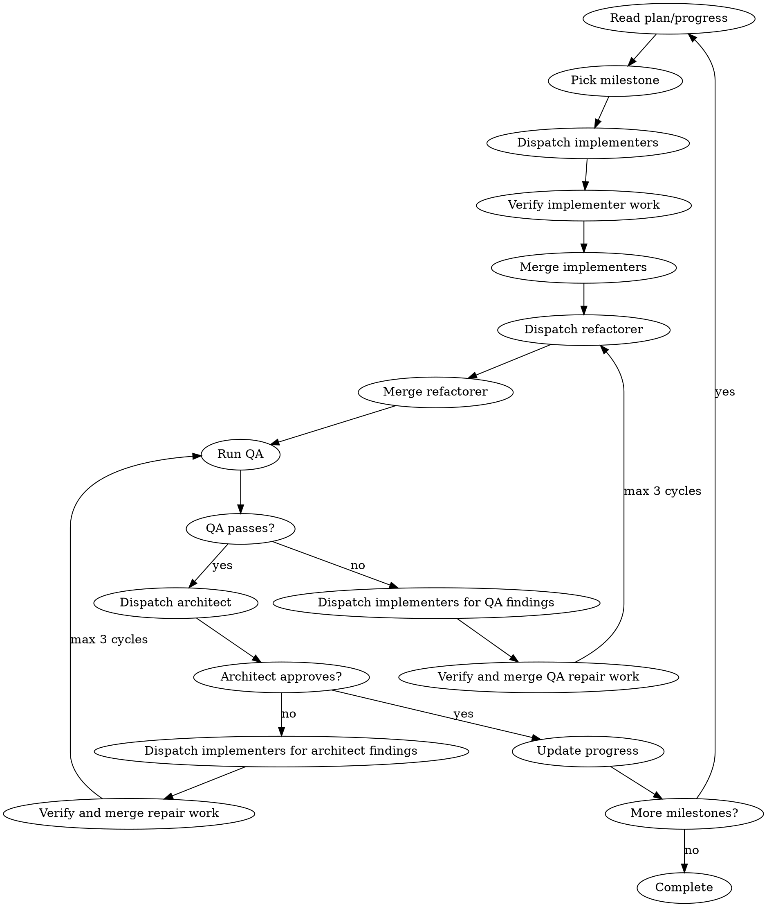

# Shepherd

## Gated Workflow

Run the phases in order. A step is complete only when its artifact exists, its
gate passes, and `.shepherd/progress.md` records the state. If a gate cannot
pass, record the blocker or explicit waiver before moving on.

```text
SETUP
  1. Intent -> 2. Spec Draft -> 3. Spec Review -> 4. Spec Approval
  -> 5. Verification Plan -> 6. Standards -> 7. Plan -> 8. Setup Close
MILESTONE LOOP
  Implementers -> verify/merge -> refactorer -> QA -> architect
  -> repair loop if needed
COMPLETION
  Final QA -> Final Hardening Review -> critical repair loop -> cleanup -> final report
```

## Use Shepherd When

- The work spans multiple milestones, hours, or days.
- The user asks for autonomous end-to-end delivery.
- Parallel implementation, refactoring, hardening, and architect-finding repair cycles are useful.

Do not use Shepherd for one-shot fixes, single-file edits, short debugging sessions, or work that needs tight user approval after every step.

## Operating Model

- You are the coordinator: own sequencing, dispatch, merges, and `.shepherd/*` state.
- State files are working memory: re-read them before decisions and update `.shepherd/progress.md` after actions.
- Delegate non-trivial implementation to worktree-isolated agents. Direct work is for trivial edits, one known file, one verification command, merge conflicts, and `.shepherd/` updates.
- Phase 1 is the user-interaction window. After sign-off, proceed autonomously unless there is no autonomous path forward.

## State Files

| File | Purpose |
|---|---|
| `.shepherd/spec.md` | Canonical product intent, user-visible behavior, acceptance criteria, examples, and accepted exceptions. |
| `.shepherd/verification.md` | Generated verification plan/report keyed by AC IDs in `spec.md`; records proof modality, required artifacts, QA result, evidence paths, verified revision, evidence state, and waivers. It must not redefine acceptance criteria. |
| `.shepherd/standards.md` | Project rules, relevant skill guidance, verification commands, constraints, and waivers. |
| `.shepherd/plan.md` | Reviewed implementation plan from the `plan` skill. |
| `.shepherd/progress.md` | Current milestone, commits, evidence, decisions, architecture state, blockers, waivers. |

Use `references/project-templates.md` for `standards.md` and `progress.md`. The `spec` and `plan` skills own their own formats.

## Progress Reconciliation Gate

Progress is the handoff contract between roles. Before dispatching refactorer, QA, architect, Final QA, Final Hardening Review, or the final report:

1. Re-read `.shepherd/progress.md`, `.shepherd/plan.md`, `.shepherd/verification.md`, latest validator logs, and the latest applicable role verdict.
2. Compare progress against plan status, QA results, validator results, evidence state, and role verdicts.
3. Fix stale or contradictory progress before the next dispatch or report.

Block dispatch or final reporting when progress and supporting artifacts disagree.

## Step Completion Gates

Every setup step has a concrete artifact. Do not advance by intent or chat summary.

| Step | Required Artifact | Gate |
|---|---|---|
| Intent | `.shepherd/spec.md` has `## Confirmed Intent`. | User-confirmed intent is recorded. |
| Spec Draft | `.shepherd/spec.md` is completed by the `spec` skill. | Draft includes explicit acceptance criteria for behavior-changing work. |
| Spec Review | Spec Review output and review HTML exist. | Every behavior-changing AC is measurable, provable, owned, stale-evidence aware, and bounded against extra behavior. |
| Spec Approval | Full spec review artifact is presented. | Human approval happens after rewrites and assumptions are visible; reviewer rewrites are not silently accepted. |
| Verification Plan | `.shepherd/verification.md` exists. | Rows reference AC IDs from the approved spec, do not redefine AC behavior, and pass `validate_verification.py --allow-pending`. |
| Standards | `.shepherd/standards.md` exists. | Repo commands, constraints, relevant skill guidance, verification rules, and waivers are recorded. |
| Plan | `.shepherd/plan.md` exists. | `plan` returns `READY` and the user signs off the plan. |
| Setup Close | `.shepherd/progress.md` records setup completion. | Autonomous milestone execution may start. |

## Roles

| Role | Owns | Does Not Own |
|---|---|---|
| Coordinator | State, sequencing, dispatch, merges, progress evidence. | Implementation, refactoring, architectural hardening. |
| Implementer | Assigned behavior slice or architect finding, implementation discipline via `tdd-mutation`, repo-defined verification, candidate evidence artifacts. | Broad cleanup, hardening, acceptance decisions. |
| Refactorer | Behavior-preserving cleanup after implementer merge: names, duplication, boundaries, testability, weak tests. | New behavior, hardening. |
| QA | Independent verification that the actual diff satisfies the approved spec/ACs, using the verification report and evidence artifacts. | Implementation, refactoring, architecture hardening, trusting reports as proof, judging against implementer claims instead of the spec. |
| Architect | Boundaries, dependency direction, hardening tools already present in the repo, milestone or final hardening verdict after QA. | New product behavior, spec rewrite, QA. |

Spec Review and Plan Review are setup gates, not execution roles. The `spec` and `plan` skills draft their artifacts; Shepherd only gates those artifacts before implementation starts.

## Phase 1: Setup

### 1. Intent

Create `.shepherd/progress.md` from `references/project-templates.md`, then invoke `interview-me`. Write the confirmed intent into `.shepherd/spec.md` under `## Confirmed Intent` and record setup start in progress.

### 2. Spec Draft

Invoke `spec`. Direct it to use `.shepherd/spec.md` as locked input and complete the spec there.

For behavior-changing work, make the spec concrete enough to test:

- user-visible behavior only
- behavior-relevant examples, preferably executable examples or a documented equivalent
- explicit scenarios that cannot be verified automatically
- explicit user-approved exceptions

Do not present the draft for sign-off until Spec Review has either approved the acceptance criteria or produced explicit proposed rewrites/blockers for human approval.

### 3. Spec Review

Dispatch `prompts/spec-review.md`. Setup blocks until every behavior-changing AC is observable, measurable, provable, owned, and explicit about stale evidence and extra behavior. The reviewer may propose measurable rewrites, but product-semantic guesses require human approval.

### 4. Spec Approval

Generate a full-spec review artifact before user sign-off. It shows the whole spec, reviewer comments, proposed AC rewrites, assumptions, required proof, unresolved questions, and human approval needs. Static HTML is acceptable; it must not mutate Shepherd state directly.

### 5. Verification Plan

Create `.shepherd/verification.md` from the approved spec using `references/project-templates.md`. It references spec AC IDs and records how each AC will be proved; it must not invent or rewrite behavior. Run:

```bash
python3 skills/shepherd/scripts/validate_verification.py --allow-pending .shepherd/verification.md
```

### 6. Standards

Create `.shepherd/standards.md` from repo truth and relevant skill truth. Treat it as the project constitution for this run: exact commands, constraints, applicable technology guidance, verification expectations, and waivers.

1. Inspect the repo directly for small codebases; dispatch exploration agents for large or unfamiliar ones.
2. Inspect available skills and read only those relevant to the run's stack, libraries, architecture, delivery surface, and verification needs.
3. Extract project-applicable best practices and architectural patterns from those skills. Record guidance that can change planning or execution: chosen patterns, prohibited patterns, module boundaries, data flow, API/client/server ownership, verification expectations, and required evidence.
4. When a skill points to current library, framework, SDK, or cloud-service documentation, verify the current docs before recording that guidance.
5. Record project-specific verification commands and quality rules.
6. Record only commands that already exist in the repo or are required by the relevant skill. Do not invent verification infrastructure or command placeholders.

### 7. Plan

Invoke `plan`. Direct it to read `.shepherd/spec.md`, `.shepherd/verification.md`, and `.shepherd/standards.md`, then write `.shepherd/plan.md`. The plan must apply the applicable guidance in `.shepherd/standards.md` to architecture choices, task boundaries, task order, and verification.

Shepherd-specific plan constraints:

- verification commands must be executable in the actual workspace
- behavior-changing milestones include implementer verification, refactorer pass, QA, architect hardening, and finding repair cycles
- behavior-changing implementation follows `tdd-mutation`; integration/e2e evidence supplements it, not replaces it

If `plan` returns `USER DECISION REQUIRED`, stop and present the decision. If it returns `READY`, update stale plan status/checklists before presenting `.shepherd/plan.md` for final sign-off.

### 8. Setup Close

Record setup completion, verification state, and architecture decisions in `.shepherd/progress.md`. Then execute autonomously.

## Phase 2: Milestone Loop



Per milestone:

1. Read `.shepherd/progress.md`, `.shepherd/plan.md`, and `.shepherd/verification.md`.
2. Categorize tasks as parallel or sequential.
3. Dispatch at most 5 parallel implementers in separate git worktrees.
4. Verify each implementer worktree with repo-defined unit tests, integration/end-to-end checks, lint, and type checks when commands exist.
5. Merge passing implementer work. Resolve conflicts immediately.
6. Reconcile progress, then dispatch refactorer from merged main for behavior-changing milestones; merge if it changed files.
7. Update `.shepherd/verification.md` with candidate evidence paths and verified state. Candidate evidence is not accepted proof until QA checks it against the approved spec/ACs.
8. Run verification/evidence/freshness validators after the latest verification or evidence change; failures block QA.
9. Reconcile progress, then dispatch QA from merged main. QA reads actual files/artifacts, may rerun checks, and writes PASS, FAIL, or WAIVED per AC against the approved spec, not the implementer report.
10. If evidence artifacts, manifests, or verification rows change after QA, rerun validators and rerun or refocus QA on the changed ACs before architect review.
11. Run the Progress Reconciliation Gate, then dispatch architect only after QA passes or records an explicit user-approved waiver.
12. If architect changes behavior-relevant files, mark affected AC evidence stale and rerun validators plus QA before milestone approval.
13. Record branches, commits, verification output, QA verdicts, waivers, and decisions in `progress.md`.
14. Dispatch implementers for exact QA or architect findings, then verify and merge passing repair work. Re-run refactorer, validators, QA, and architect until approved or 3 repair cycles are reached.
15. Log milestone summary and architecture state.

Sequential tasks wait for their prerequisites to merge, then run from updated main.

## Dispatch Prompts

Use these prompt templates only for role dispatches that need Shepherd-specific context:

| Dispatch | Prompt | When |
|---|---|---|
| Spec Review | `prompts/spec-review.md` | After spec draft, before spec approval and plan. |
| Implementer | `prompts/implementer.md` | Assigned behavior slice or architect finding. |
| Refactorer | `prompts/refactorer.md` | After implementer merge, before architect. |
| QA | `prompts/qa.md` | After refactorer merge, before architect, and after behavior-relevant architect changes. |
| Architect | `prompts/architect.md` | After QA passes for milestone architecture review and Final Hardening Review. |

Exploration uses the runtime's built-in exploration agent. Planning belongs to the `plan` skill.

## Phase 3: Completion

1. Reconcile progress, then run Final QA across every AC in `.shepherd/spec.md` using `.shepherd/verification.md` as the evidence map.
2. Reconcile progress, then dispatch Architect for Final Hardening Review across the full diff only after QA passes.
3. If Final Hardening Review changes behavior-relevant files, mark affected AC evidence stale and rerun QA.
4. Run the same implementer repair cycle for critical final findings, max 3 iterations.
5. Run verification gate scripts from `references/verification-evidence.md`.
6. Record final verification, waivers, and final verdict in `progress.md`.
7. Remove non-main git worktrees with `git worktree remove -f -f <path>`, then delete their branches.
8. Reconcile progress, then report what shipped, the verification matrix, evidence paths/state, accepted limitations, and deferred work.

## Blockers

Do not proceed as green when any of these are true:

- verification fails and the failure is not recorded as pre-existing debt
- a repo-defined verification command is skipped without an explicit waiver
- `.shepherd/verification.md` is missing, incomplete, stale, or has invalid rows
- verification report, evidence, or freshness validators fail after the latest evidence or verification change
- an approval, plan, progress, or checklist artifact contradicts the current recorded gate state
- the Progress Reconciliation Gate has not run before a role dispatch or final report
- QA has not passed for the behavior-changing ACs in the current milestone
- evidence artifacts, manifests, or verification rows changed after QA without validator rerun and QA recheck
- proof requirements in `references/verification-evidence.md` are unmet
- unapproved extra user-visible behavior is present
- architect requests changes and the implementer repair cycle has not run
- `.shepherd/progress.md` is stale
- sibling worktrees or branches are used without explicit coordinator naming

## References

- `references/project-templates.md`: use when creating `standards.md` or `progress.md`.
- `references/verification-evidence.md`: use when creating `.shepherd/verification.md`, collecting evidence, running QA, or preparing completion.
- `prompts/*.md`: load only when dispatching that role.
