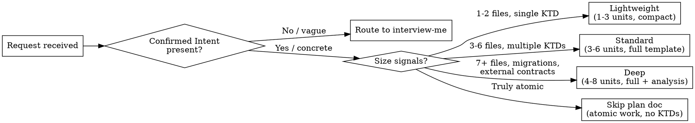
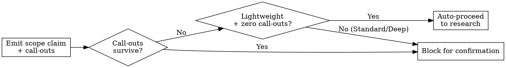
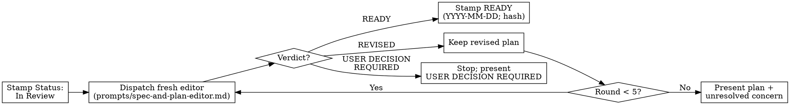

# Spec-and-Plan

Sequencing spec and plan in a single invocation eliminates the coordination gap between them — the most common place where intent drifts into implementation assumptions.

## When to Use / Boundary

Triggering on the wrong class of request produces a plan for a problem that has not been fully scoped or a redundant artifact when only one half is needed.

**Trigger when all hold:**
- User has a concrete request (Confirmed Intent from interview-me present, or idea is specific enough to commit to)
- Both the spec (WHAT) and plan (HOW) artifacts are missing
- User says "spec and plan this", "help me go from idea to a ready plan", or "turn this into a READY plan"

**Do not trigger when:**
- Intent is still vague → use `interview-me` first
- Spec exists, only a plan is needed → use `plan`
- Requirements are clear, only a spec is needed → use `spec`
- Long-running autonomous execution is requested → use `shepherd`
- An existing plan needs revision or review only → use `plan`

## Core Doctrines

These principles are load-bearing. Violating any one produces a plan that looks complete but cannot be executed reliably.

1. **WHAT-vs-HOW separation.** The spec answers "what"; the plan answers "how." Never write implementation decisions (file paths, key technical decisions, approach) inside the spec's six areas, and never re-state behavioral requirements inside plan units.
2. **Decisions-not-code.** The plan captures approach, scope boundaries, dependencies, and test scenarios. No pre-written code, method signatures, or shell choreography. Pseudo-code only in an explicit High-Level Technical Design section framed as direction, not specification.
3. **Stable U-IDs on headings, never checkboxes.** Each implementation unit is a `### U<N>. Title` heading with sequential, never-renumbered IDs. Gaps from splits or deletes are correct. New units take the next unused integer. Units are headings because per-unit field blocks (paragraphs, lists, code) terminate CommonMark list continuation and detach from checkbox parent items.
4. **Requirements traceability (R-IDs → U-IDs).** Every requirement gets a stable R-ID. Each unit's Requirements field cites the R-IDs it advances. Every R-ID must land in at least one unit or be explicitly deferred — nothing is silently dropped.
5. **Enumerated per-unit test scenarios.** For every feature-bearing unit: happy-path (named input + action + expected outcome), edge cases, error/failure paths, integration scenarios. Specificity bar: each scenario names input, action, and expected outcome. See `references/plan-sections.md` for the category catalog.
6. **Repo-relative paths everywhere.** All file paths in the plan are repo-relative (e.g., `src/auth/session.ts`). Never absolute.
7. **Honor named resources.** When the user names a CLI, MCP server, URL, file, or prior artifact — discover it before assuming unavailability. Use it in place of generic alternatives.
8. **Separate plan-time from execution-time unknowns.** Resolve anything answerable from the codebase or user input during planning. Record anything that requires runtime discovery as an explicit deferred implementation note — never state it as resolved.
9. **Anti-expansion.** Tangential refactors and "while we're here" cleanups go to a `Deferred` subsection in Scope Boundaries, not into active units. User-confirmed scope overrides.

## Phase 0: Frame and Right-Size

Classify the work before producing any artifact — the wrong depth wastes time or omits critical structure.



If Confirmed Intent is present, read it as locked input — do not re-interview.

Read `references/research-phase.md` when work may involve external research or when initial depth classification may need reclassification.

## Phase 1: Spec the WHAT

Producing the spec before the plan prevents implementation decisions from contaminating behavioral requirements.

If a current spec file exists and is up to date, read it and stamp R-IDs without rewriting. If no spec exists, produce the six-area structure:

1. **Commands** — full executable commands with flags
2. **Project Structure** — where source, tests, docs live
3. **Code Style** — one real snippet beats three paragraphs
4. **Testing Strategy** — framework, locations, coverage, levels
5. **Boundaries** — Always / Ask first / Never
6. **Success Criteria** — specific, testable conditions reframed from vague requirements

Assign stable R-IDs (R1, R2, …) to every requirement in Success Criteria and any behavioral constraint in Boundaries. Surface assumptions before writing; list them explicitly and ask for correction before proceeding.

## Pre-Research Scope Synthesis / Call-Outs Gate

Before spending research effort, emit a compressed scope claim — what the plan will cover, what it will not — plus any surviving call-outs (forks where user input changes the plan, passable without reading code).



Emit the scope claim and call-outs in this canonical form:

```
Scope claim: [one sentence what the plan covers].
Out of scope: [list].
Call-out N: [decision description] — options are [A / B / other] — default if no reply: [default].
```

Gate the proceed decision on depth and surviving call-outs, matching the diagram: a **Lightweight** plan with zero surviving call-outs auto-proceeds to research; **Standard** and **Deep** plans confirm the scope claim before research even when no call-outs survive; any plan with a surviving call-out blocks for user input. When no live user is present (automated or pipeline run), auto-proceed and record each assumed default under an `Assumptions` heading instead of blocking. Implementation details (file paths, method signatures, HTTP status codes) belong in the plan body, not in the scope claim.

## Phase 2: Research Before Structuring

Exploring the codebase before imposing structure surfaces real patterns and prevents planning against assumptions.

Search local patterns first. External research fires only when: user explicitly requested it; topic is high-risk (auth, payments, migrations, external APIs); or fewer than 3 direct local examples exist. When external research shapes a KTD, Alternative, Scope boundary, or Risk — retain it. When it shaped nothing — drop it.

Reclassify depth to Standard when work touches env vars consumed externally, exported public APIs or CLI flags, CI/CD config, shared types imported downstream, or documentation at external URLs. Announce reclassification before continuing.

Read `references/research-phase.md` for the full skip/run criteria table, intent classification (implementation-guidance vs. landscape-discovery vs. mixed), and monorepo adjacency scoping.

## Phase 3: Plan the HOW

A dependency graph built before writing units prevents sequencing errors that force rework mid-execution.

1. Map what depends on what (schema → models → endpoints → clients → UI).
2. Slice vertically — one complete feature path per unit, not horizontal layers.
3. Write units as `### U<N>. Title` headings in dependency order.

**Per-unit fields (in this order):**

**Goal:** One sentence — what this unit delivers.

**Requirements:** R-IDs this unit advances (e.g., R1, R3).

**Dependencies:** U-IDs this unit depends on, or "None".

**Files:** Repo-relative paths only.

**Approach:** Decisions and direction in plain prose. No pre-written code.

**Test scenarios:** Enumerated scenarios — happy-path, edge cases, error/failure paths, integration scenarios. Each names input, action, expected outcome. For non-feature-bearing units: `Test expectation: none -- [reason]`.

**Risks (per-unit inline):** For Standard and Deep plans — name the specific failure mode, probability/impact, and mitigation or deferred spike. Omit for Lightweight plans unless a unit carries an identified blocker. See `references/plan-sections.md` for depth table.

**Verification:** Concrete commands the implementer runs to confirm the unit is done.

Include a High-Level Technical Design section only when shape does not carry in prose (multi-component architecture, sequences, state machines). Tangential cleanup goes to Deferred, not active units.

Read `references/plan-sections.md` when writing implementation unit fields or selecting test scenario categories.

## Phase 4: Up-the-Hill Review

A plan is not ready because it exists — an independent editor must judge it before execution begins.



1. Stamp `Status: In Review — up-the-hill review active`.
2. Dispatch a fresh editor using `prompts/spec-and-plan-editor.md` (self-contained; receives original request, spec path, plan path, caller constraints).
3. On `READY`: the orchestrator (not the editor) immediately stamps the artifact's Status line to exactly `Status: READY — reviewed YYYY-MM-DD; commit <short-hash>; verdict READY`, using the date and commit hash from the editor's ## Commit output block (use `not committed` for the hash when the plan file is not yet committed).
4. On `REVISED`: retain the revised plan; dispatch a new fresh editor.
5. On `USER DECISION REQUIRED`: stop and present the decision.
6. After 5 rounds without `READY`: present latest plan plus unresolved concern. Do not proceed to execution.

Verdicts are exactly: `READY`, `REVISED`, `USER DECISION REQUIRED`. The editor uses the same verdicts, 5-round cap, and Status lifecycle as the plan skill's editor, plus two additional output blocks (Requirements traceability, Confidence rubric) not present in plan's editor.

Read `references/confidence-rubric.md` when the plan is high-risk (auth, payments, migrations, external APIs) or when external research was load-bearing.

## Task Sizing Table

Right-sizing units before writing them prevents oversized tasks that stall and undersized tasks that lose cross-unit context.

| Size | Files | Scope | Example |
|------|-------|-------|---------|
| XS | 1 | Single function or config change | Add a validation rule |
| S | 1-2 | One component or endpoint | Add a new API endpoint |
| M | 3-5 | One feature slice | User registration flow |
| L | 5-8 | Multi-component feature | Search with filtering and pagination |
| XL | 8+ | **Break it down further** | — |

**When to break further:** task would span more than one focused session; acceptance criteria need more than 3 bullets; task touches two independent subsystems; task title contains "and".

## Unified Artifact Template

```markdown
# Spec-and-Plan: [Feature Name]

> Status: **Draft — pending up-the-hill review**

## Spec

### Commands
[full commands with flags]

### Project Structure
[directory layout]

### Code Style
[snippet + conventions]

### Testing Strategy
[framework, locations, coverage]

### Boundaries
- Always: [...]
- Ask first: [...]
- Never: [...]

### Success Criteria
- R1: [testable criterion]
- R2: [testable criterion]

## Implementation Plan

### U1. [Title]

**Goal:** ...

**Requirements:** R1, R2

**Dependencies:** None

**Files:** src/...

**Approach:** ...

**Risks:** [failure mode] — [probability/impact] — [mitigation or deferred spike]

**Test scenarios:**
- Happy-path: [input] → [action] → [expected]
- Edge: [boundary] → [action] → [expected]
- Error: [invalid input] → [action] → [expected]
- Integration: [layers] → [action] → [expected]

**Verification:** `npm test -- --grep "..."`

### U2. [Title]
...

## Scope Boundaries

**In scope:** [confirmed items]

**Out of scope:** [explicit exclusions]

**Deferred to follow-up work:** [tangential items surfaced during research]
```

Status lifecycle: `Draft` -> `In Review` -> `READY` -> `In Progress` -> `Done`

## Parallelization

Knowing which units can run concurrently and which must be sequential prevents implementers from starting work that blocks on an unfinished dependency.

- **Safe to parallelize:** independent feature slices, tests for already-implemented features
- **Must be sequential:** migrations, shared-state changes, dependency chains
- **Needs coordination:** features sharing an API contract — define the contract first, then parallelize

## Anti-Patterns and Fixes

| Failure mode | Fix |
|---|---|
| Spec-as-HOW contamination — writing file paths or approach decisions into spec's six areas | Spec describes WHAT; plan describes HOW. Move implementation decisions to plan units. |
| Flat checkbox units — `- [ ] U1: add auth` with no field blocks | Use `### U1. Add auth` headings. Per-unit fields are flush-left multi-block content that detaches from checkbox parent items. |
| Vague test scenarios — "ensure it works" | Name input, action, and expected outcome for every scenario. "ensure it works" ships as an unchecked assumption. |
| Silent scope creep — tangential refactors absorbed into active units | Route to Deferred subsection in Scope Boundaries. |
| False certainty in unknowns — runtime-discovery items stated as resolved | Mark as deferred implementation note. |

## Red Flags

- Intent was still vague when spec-and-plan was triggered (should have routed to `interview-me`)
- Plan has no R-ID traceability — units do not cite requirement IDs
- Units have blank or "TBD" test scenarios
- `Status:` line was never stamped
- Up-the-hill review loop was skipped
- Units are checkbox items instead of `### U-ID` headings
- Tangential cleanups absorbed into active units instead of Deferred
- A named CLI, MCP server, or artifact was not discovered before the plan was written
- Standard or Deep plan has no scope claim section before the research phase

## Verification Checklist

Run as Y/N gate before handing off. Rows marked **blocker** must pass.

| Check | Blocker? |
|---|---|
| Six-area spec complete with R-IDs | Yes |
| Every R-ID appears in at least one unit or is explicitly deferred | Yes |
| Every unit is a `### U<N>.` heading (no checkbox lists) | Yes |
| Every feature-bearing unit has enumerated test scenarios (not blank, not TBD) | Yes |
| No implementation code in the plan body | Yes |
| Status stamped READY | Yes |
| Plan editor returned READY within 5 rounds | Yes |
| All file paths are repo-relative | No |
| Tangential work is in Deferred, not active units | No |
| Every CLI, MCP server, URL, or prior artifact named by the user was discovered and used (or a named reason was given for unavailability) | Yes |

## References

- Read `references/research-phase.md` when work may involve external research or when initial depth classification may need reclassification.
- Read `references/plan-sections.md` when writing implementation unit fields or selecting test scenario categories.
- Read `references/confidence-rubric.md` when the plan is high-risk (auth, payments, migrations, external APIs) or when external research was load-bearing.
- Dispatch `prompts/spec-and-plan-editor.md` for each up-the-hill review round.
